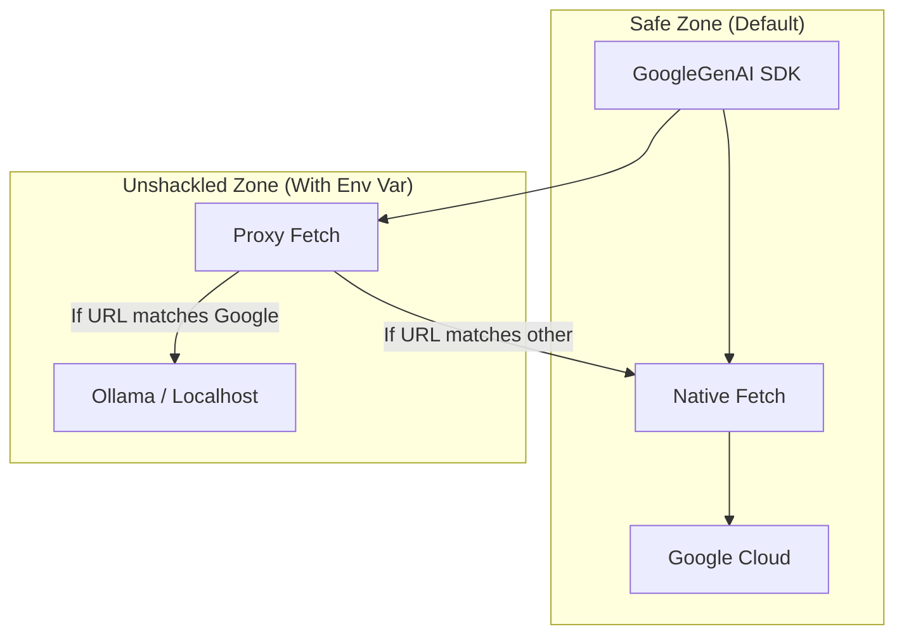

# Plan: Expand TerminaI Beyond Gemini

## 1. Strategic Analysis

### The Case FOR Expansion (The "Unshackled" Strategy)

- **Total Market Addressability**: Currently, you ignore 100% of users who
  prefer Llama/Ollama or are privacy-absolutists. This feature instantly
  captures that market without losing Gemini users.
- **Insulation from Google**: If Google deprecates the Free Tier or changes the
  API terms tomorrow, `TerminaI` dies. With this feature, `TerminaI` survives as
  a generic AI terminal.
- **The "Pro" Wedge**: Power users _hate_ arbitrary restrictions. Being the
  "Gemini CLI that lets you use other models" is a unique value proposition that
  the official CLI can never copy.
- **Dev-Loop Velocity**: Local models (like minimal Llama 3) running on
  localhost have 0ms network latency. For simple tasks (git commit messages,
  basic refactors), this beats cloud latency every time.

### The Case AGAINST Expansion (The Risks)

- **"Works on My Machine" Syndrome**: Debugging issues becomes 10x harder. A
  user complaining about "bad code generation" might be running a 4-bit
  quantized potato model on their laptop, not Gemini Pro. You will close many
  issues with "Not a TerminaI bug."
- **Experience Fragmentation**: Gemini has specific features (Code Execution,
  Search Grounding) that local models lack. You will need to gracefully disable
  UI elements (like the "Search" icon) when connected to a "dumb" endpoint, or
  the UX will feel broken.
- **Support Burden**: You become tech support for people's broken Ollama setups.

## 2. Technical Risk Assessment ("Will this be Hell?")

**Verdict: Low Risk (1/5 Hell Scale) — IF implemented correctly.**

- **Why it's Safe**: We will use a **"Bypass Architecture"**.
  - **Default State**: If `TERMINAI_BASE_URL` is not set, the code executes
    _exactly_ as it does today. Zero logical changes to the happy path.
  - **Override State**: Only when the user _explicitly_ sets the env var do we
    inject the interceptor.
  - **Regression Risk**: Near zero. You can deploy this and 99% of your users
    won't even know the code exists.

- **The Only "Hell" Scenario**:
  - If we try to rewrite the `GoogleGenAI` SDK calls to use a generic `fetch`
    client manually. **We must NOT do this.** We must let the Google SDK do its
    job and just hijack the transport layer.

## 3. Architecture: The Fetch Interceptor

We will use a **Global Fetch Proxy**. This is the standard pattern for testing
and redirection in Node.js.

## 4. Technical Execution Plan

### Phase 1: The Foundation (1-2 Hours)

- [ ] **Create Interceptor Utility**: Create
      `packages/core/src/utils/fetchInterceptor.ts`.
  - It should accept a target `baseUrl`.
  - It should verify if the request is destined for
    `generativelanguage.googleapis.com`.
  - It should rewrite the URL `host` and `protocol` to the target.
- [ ] **Inject at Startup**: Modify `packages/cli/src/bin/gemini.js` (or entry
      point).
  - Read `process.env.TERMINAI_BASE_URL`.
  - If present, call `installFetchInterceptor(url)`.

### Phase 2: The "Universal Key" (1 Hour)

- [ ] **Bypass Auth Check**: Modify
      `packages/core/src/core/contentGenerator.ts`.
  - In `createContentGeneratorConfig`, if `TERMINAI_API_KEY` is present, stop
    checking for `GOOGLE_CLOUD_PROJECT`.
  - Force `authType = AuthType.USE_GEMINI`.

### Phase 3: The Ollama Bridge (2-3 Hours)

_Note: The Google SDK sends Google-formatted JSON. Ollama expects
OpenAI-formatted JSON. We need a translation layer if we want to support Ollama
directly._

- [ ] **Simple Translator**: Add a transformation step in `fetchInterceptor.ts`.
  - Detect if target is Ollama.
  - Convert `{"contents": [{"parts": [{"text": "..."}]}]}` ->
    `{"messages": [{"role": "user", "content": "..."}]}`.
  - _Self-Correction_: Instead of writing a transformer, we can recommend users
    use a standard **LiteLLM** proxy locally, which handles this translation
    perfectly. This keeps _your_ codebase clean. **Recommendation: Document
    LiteLLM usage, don't build a transformer yet.**

## 5. Recommendation

**GO FOR IT.** The implementation cost is minimal (< 1 day) if you skip the
"Ollama JSON Transformer" and just support "Gemini-compatible endpoints" (which
includes LiteLLM, vLLM, and others).

It is a low-risk, high-reward move that separates you from the "Wrapper" crowd.
