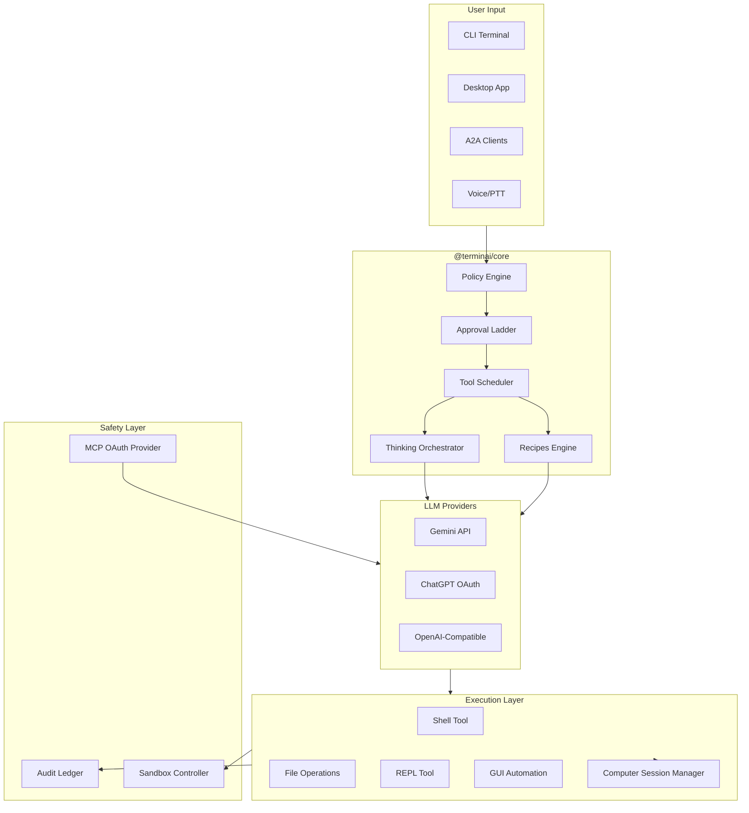

# AGENTS.md — The Definitive Guide for AI Agents

> **Purpose**: This document is the single source of truth for AI agents working
> on TerminAI. Read this completely before making any changes.
>
> **Last Updated**: January 17, 2026  
> **Scope**: All packages, all workflows, all agents

---

## Table of Contents

1. [Project Identity](#project-identity)
2. [Architecture Overview](#architecture-overview)
3. [The Golden Rules](#the-golden-rules)
4. [Package Guide](#package-guide)
5. [Development Workflows](#development-workflows)
6. [Code Standards](#code-standards)
7. [Safety & Governance](#safety--governance)
8. [Testing Protocol](#testing-protocol)
9. [Documentation Guidelines](#documentation-guidelines)
10. [Upstream Maintenance](#upstream-maintenance)
11. [Common Pitfalls](#common-pitfalls)
12. [Quick Reference](#quick-reference)

---

## Project Identity

### What is TerminAI?

TerminAI is an **AI-powered system operator** — not just a coding assistant.

```
┌─────────────────────────────────────────────────────────────────────┐
│                         TERMINAI THESIS                              │
│                                                                     │
│   "Google provides the intelligence.                                │
│    TerminAI provides the root access and the guardrails."          │
│                                                                     │
│   We are building GOVERNED AUTONOMY for systems and servers.       │
└─────────────────────────────────────────────────────────────────────┘
```

### What Makes Us Different

| Capability                                           | TerminAI | Others  |
| ---------------------------------------------------- | -------- | ------- |
| Actually executes (not just suggests)                | ✅       | Rare    |
| Policy gating (approval before action)               | ✅       | ❌      |
| Three-axis security (Outcome/Intent/Domain)          | ✅       | ❌      |
| Audit trail (immutable, non-disableable)             | ✅       | ❌      |
| Voice control (push-to-talk STT/TTS)                 | ✅       | ❌      |
| Agent-to-Agent protocol                              | ✅       | ❌      |
| Multi-LLM (Gemini, ChatGPT OAuth, OpenAI-compatible) | ✅       | Limited |
| Native Windows support                               | ✅       | Limited |
| Recipes engine (governed playbooks)                  | ✅       | ❌      |

### The Vision Stack

```
┌─────────────────────────────────────────────────────────────────────┐
│  END USERS: "Fix my computer" — actually works                     │
├─────────────────────────────────────────────────────────────────────┤
│  POWER USERS: Voice control, process orchestration, MCP extensions │
├─────────────────────────────────────────────────────────────────────┤
│  DEVELOPERS: A2A protocol, PTY bridge, policy engine primitives    │
├─────────────────────────────────────────────────────────────────────┤
│  ORGANIZATIONS: Non-repudiable logs, approval workflows, fleet-ready│
└─────────────────────────────────────────────────────────────────────┘
```

---

## Architecture Overview

### Monorepo Structure

```
terminaI/
├── packages/
│   ├── core/           # 🧠 Engine: tools, policy, safety, telemetry
│   ├── cli/            # ⌨️  Terminal UI (Ink/React)
│   ├── desktop/        # 🖥️  Tauri app + PTY bridge
│   ├── a2a-server/     # 🔌 Agent-to-Agent control plane
│   ├── termai/         # 🚀 The `terminai` launcher
│   ├── evolution-lab/  # 🧪 Automated testing harness (Docker-default)
│   ├── cloud-relay/    # ☁️  Cloud relay server
│   ├── test-utils/     # 🧰 Testing utilities
│   ├── desktop-linux-atspi-sidecar/   # 🐧 Linux GUI sidecar
│   ├── desktop-windows-driver/        # 🪟 Windows automation driver
│   ├── vscode-ide-companion/          # 💻 VS Code integration
│   ├── web-client/     # 🌐 Web client
│   └── api/            # 📡 API definitions
├── docs/               # 📚 Upstream documentation
├── docs-terminai/      # 📖 TerminAI-specific documentation
├── .agent/workflows/   # 🔄 Agent workflow definitions
├── schemas/            # 📐 JSON Schemas (settings, policy)
└── scripts/            # ⚙️  Build and utility scripts
```

### Data Flow



---

## The Golden Rules

> **Memorize these. Violating any one is grounds for PR rejection.**

### Rule 1: Preflight Before Commit

```bash
npm run preflight
```

This single command validates: build (via Turbo) → typecheck → test → lint.
**Never commit without passing preflight.**

### Rule 2: Safety First

The approval ladder (A/B/C) is **non-negotiable**:

| Level | Meaning             | When                           |
| ----- | ------------------- | ------------------------------ |
| **A** | No approval needed  | Read-only, reversible          |
| **B** | Click-to-approve    | Mutating operations            |
| **C** | Click + 6-digit PIN | Destructive, outside workspace |

The model can **escalate** review levels but **never downgrade** them.

#### Three-Axis Security Model

Every action is classified on three dimensions:

```
┌─────────────────────────────────────────────────────────────────────┐
│                    THREE-AXIS SECURITY MODEL                        │
├──────────────────────┬──────────────────────┬──────────────────────┤
│       OUTCOME        │      INTENTION       │       DOMAIN         │
├──────────────────────┼──────────────────────┼──────────────────────┤
│ • reversible         │ • log_only           │ • workspace          │
│ • soft-irreversible  │ • confirm            │ • localhost          │
│ • irreversible       │ • pin                │ • trusted (network)  │
│                      │                      │ • untrusted          │
│                      │                      │ • system             │
└──────────────────────┴──────────────────────┴──────────────────────┘
```

**Location**: `packages/core/src/safety/approval-ladder/`

- `classifyOutcome.ts` — Determines reversibility (Git-tracked = reversible)
- `classifyDomain.ts` — Network/path classification
- `computeRisk.ts` — Routes to profile-specific risk assessment
- `computeMinimumReviewLevel.ts` — Final deterministic level (A/B/C)

#### Safety Invariants

1. **Audit is Immutable** — Cannot be disabled, write-time redacted
2. **Model Cannot Downgrade** — Brain may escalate, never lower
3. **Provenance Triggers Escalation** — Untrusted sources → higher review
4. **PIN for Level C** — 6-digit PIN required (default: `000000`)

### Rule 3: Provenance Matters

Every action must track where instructions came from:

- `local_user` — Typed by user at terminal
- `web_remote_user` — From web/desktop client
- `model_suggestion` — LLM proposed
- `workspace_file` — From project files
- `web_content` — From web fetch
- `tool_output` — From previous tool

Untrusted provenance → automatic escalation.

### Rule 4: No Bypass Paths

All code execution flows through governed tools:

```
❌ WRONG: Direct process.spawn() in brain
✅ RIGHT: execute_repl tool → CoreToolScheduler → approval → audit
```

### Rule 5: TERMINAI\_\* Environment Variables

- **Canonical**: `TERMINAI_*` (e.g., `TERMINAI_API_KEY`)
- **Legacy supported**: `GEMINI_*` (via `applyTerminaiEnvAliases()`)
- **Directory**: `.terminai` (canonical), `.gemini` (legacy supported)

### Rule 6: TypeScript Strictness

- **No `any`** — Use `unknown` and narrow with type guards
- **No type assertions** unless absolutely necessary with comment
- **Exhaust switches** — Use `checkExhaustive()` helper
- **Plain objects > classes** — Interfaces + functions

### Rule 7: Test Coverage

Every behavior change requires:

1. Unit test for the component
2. Integration test for the feature
3. Manual verification steps documented

---

## Package Guide

### `@terminai/core` — The Engine

**Location**: `packages/core/`  
**Purpose**: All shared logic, tools, policy, and LLM integration

```
packages/core/src/
├── agents/           # Agent framework, TOML loaders
├── audit/            # 📜 Audit ledger (immutable, non-disableable)
├── brain/            # Thinking orchestrator, frameworks
├── computer/         # 💻 Session manager, persistent shell
├── config/           # Configuration loading, settings
├── core/             # Turn management, tool scheduling
├── hooks/            # Lifecycle hooks
├── mcp/              # MCP client/server + OAuth provider
├── policy/           # 🏛️ Policy engine (enterprise controls)
├── recipes/          # 📖 Governed playbook loader/executor
├── safety/           # Approval ladder, action profiles
├── telemetry/        # Metrics (Flicker, Exit Fail, Slow Render)
├── tools/            # Built-in tools (shell, edit, etc.)
└── utils/            # Utilities, env aliases
```

**Key Exports**:

- `createContentGenerator()` — Factory for LLM generators
- `CoreToolScheduler` — Central tool execution
- `computeMinimumReviewLevel()` — Deterministic safety
- `ThinkingOrchestrator` — Framework selection
- `AuditLedger` — Immutable event logging
- `RecipeExecutor` — Governed playbook execution

### `@terminai/cli` — Terminal Interface

**Location**: `packages/cli/`  
**Purpose**: React/Ink-based terminal UI

**Key Files**:

- `src/gemini.tsx` — Main entry component
- `src/ui/` — All UI components
- `src/ui/commands/` — Slash command implementations
- `src/voice/` — Voice mode (STT/TTS)
- `src/config/` — CLI configuration

**Key Slash Commands**:

| Command         | Purpose                           |
| --------------- | --------------------------------- |
| `/think`        | Toggle Brain Mode (deep thinking) |
| `/evaluate`     | Generate session insights report  |
| `/audit`        | View/export audit ledger          |
| `/pin-security` | Configure 6-digit PIN             |
| `/ide`          | Toggle IDE integration mode       |
| `/policies`     | View active enterprise policies   |
| `/stats`        | Display usage statistics          |
| `/recipes`      | List/run governed playbooks       |
| `/llm`          | Switch LLM provider mid-session   |
| `/logs`         | View session logs                 |

**Voice Mode**: Push-to-talk with `/voice install` for whisper.cpp STT.

**Testing**: Use `ink-testing-library` with `render()` and `lastFrame()`.

### `@terminai/desktop` — Tauri Application

**Location**: `packages/desktop/`  
**Purpose**: Native desktop app with PTY bridge

```
packages/desktop/
├── src/              # React frontend
├── src-tauri/        # Rust backend
│   └── src/
│       ├── main.rs           # Entry point
│       ├── pty_session.rs    # PTY management
│       └── bridge.rs         # IPC bridge
└── src/bridge/       # TypeScript bridge layer
```

### `@terminai/a2a-server` — Control Plane

**Location**: `packages/a2a-server/`  
**Purpose**: HTTP server for remote control

**Security Model**:

- Loopback by default
- Token authentication
- Request signing

### `@terminai/evolution-lab` — Testing Harness

**Location**: `packages/evolution-lab/`  
**Purpose**: Automated adversarial testing

**Components**:

- `adversary.ts` — Task generation
- `sandbox.ts` — Environment management
- `runner.ts` — Execution orchestration
- `aggregator.ts` — Failure clustering

---

## Development Workflows

### The Full Cycle

```
/brainstorm → /architect → /tasks → /crosscheck → /execute → /review → /fix → /final-review → /ship
```

| Stage | Command         | Output             |
| ----- | --------------- | ------------------ |
| 1     | `/brainstorm`   | Chosen approach    |
| 2     | `/architect`    | Technical spec     |
| 3     | `/tasks`        | Detailed checklist |
| 4     | `/crosscheck`   | Gap analysis       |
| 5     | `/execute`      | Working code       |
| 6     | `/review`       | Issue list         |
| 7     | `/fix`          | Clean code         |
| 8     | `/final-review` | Final verdict      |
| 9     | `/ship`         | Merged PR          |

### When to Start Where

- **New feature** → Start at `/brainstorm`
- **Spec exists** → Start at `/tasks`
- **Code exists** → Start at `/review`
- **Bugs only** → Start at `/fix`
- **Ready to merge** → Start at `/ship`

### Turbo Mode (and Turborepo)

TerminAI uses **Turborepo** for high-performance builds.

- `npm run build` is an alias for `turbo run build`.
- `npm test` is an alias for `turbo run test`.

Workflows support `// turbo` annotations for auto-running safe commands:

```markdown
2. Run build // turbo
3. Run tests
```

Use `// turbo-all` to auto-run all `run_command` steps in a workflow.

---

## Code Standards

### TypeScript Conventions

```typescript
// ✅ GOOD: Plain objects with interfaces
interface UserConfig {
  readonly name: string;
  readonly settings: Settings;
}

// ❌ BAD: Classes with hidden state
class UserConfig {
  private _settings: Settings;
}
```

```typescript
// ✅ GOOD: Unknown with type narrowing
function processValue(value: unknown): string {
  if (typeof value === 'string') {
    return value.toUpperCase();
  }
  throw new Error('Expected string');
}

// ❌ BAD: Any type
function processValue(value: any): string {
  return value.toUpperCase(); // Runtime bomb
}
```

```typescript
// ✅ GOOD: Exhaustive switch with helper
import { checkExhaustive } from './utils/checks.js';

switch (frameworkId) {
  case 'FW_DIRECT':
    return handleDirect();
  case 'FW_CONSENSUS':
    return handleConsensus();
  default:
    checkExhaustive(frameworkId); // Compile error if cases missing
}
```

### React (Ink) Conventions

1. **Functional components only** — No class components
2. **Hooks at top level** — Never in conditionals
3. **Pure render functions** — Side effects in `useEffect`
4. **Avoid useEffect for state sync** — Derive state instead
5. **Rely on React Compiler** — Skip manual `useMemo`/`useCallback`

```typescript
// ✅ GOOD: Pure component
function StatusBadge({ isConnected }: Props) {
  const color = isConnected ? 'green' : 'red';
  return <Text color={color}>{isConnected ? '●' : '○'}</Text>;
}

// ❌ BAD: Side effects in render
function StatusBadge({ isConnected }: Props) {
  localStorage.setItem('status', isConnected); // NO!
  return <Text>...</Text>;
}
```

### Import Rules

- **Absolute imports** for cross-package
- **Relative imports** within same package
- **ESLint enforces** package boundaries

```typescript
// ✅ GOOD
import { Tool } from '@terminai/core';
import { helper } from './utils.js';

// ❌ BAD: Reaching into another package's internals
import { internalFn } from '../../packages/core/src/internal.js';
```

### Array Operators Over Loops

```typescript
// ✅ GOOD: Functional, immutable
const activeUsers = users.filter((u) => u.isActive).map((u) => u.name);

// ❌ BAD: Imperative, mutable
const activeUsers = [];
for (const u of users) {
  if (u.isActive) activeUsers.push(u.name);
}
```

### Comments Policy

Only write **high-value** comments:

```typescript
// ✅ GOOD: Explains why, not what
// Timeout is 30s because LLM responses can be slow on first call
const TIMEOUT_MS = 30_000;

// ❌ BAD: Explains the obvious
// Set timeout to 30000
const TIMEOUT_MS = 30000;
```

---

## Safety & Governance

### The Trust Model

```
User Intent → Policy Engine → Approval → Execution + Audit
                   │
                   ├─ Classify risk level
                   ├─ Check trust boundaries
                   └─ Route to appropriate approval flow
```

### Approval Ladder Implementation

**Location**: `packages/core/src/safety/approval-ladder/`

```typescript
// Action profiles define what's being done
interface ActionProfile {
  operationClass: OperationClass;
  targetPaths: string[];
  provenance: Provenance[];
  // ... other context
}

// Compute minimum review level deterministically
const reviewLevel = computeMinimumReviewLevel(profile, context);
// Returns: 'A' | 'B' | 'C'
```

### Invariants (Never Violate)

1. **Everything possible with explicit confirmation** — Escalate, don't block
2. **Fail closed** — Unknown operations require higher review
3. **Model cannot downgrade** — Only escalate
4. **Plain-English consent** — User sees consequences before Level B/C
5. **Provenance-aware** — Untrusted sources cannot silently authorize

### Brain Authority

The brain (thinking orchestrator) is **advisory by default**:

- May suggest approaches
- May escalate review levels
- **Cannot** execute without going through tool scheduler
- **Cannot** lower deterministic review minimums

**Authority Modes** (via `brain.authority` setting):

| Mode            | Behavior                               |
| --------------- | -------------------------------------- |
| `advisory`      | Suggestions only, no review escalation |
| `escalate-only` | May raise review level (default)       |
| `governing`     | Demands additional review more often   |

### Audit Ledger

**Location**: `packages/core/src/audit/`  
**Principle**: Non-disableable, immutable, queryable

```
┌─────────────────────────────────────────────────────────────────────┐
│                        AUDIT LEDGER                                 │
├─────────────────────────────────────────────────────────────────────┤
│  • Cannot be disabled (not a user setting)                          │
│  • Write-time secret redaction (API keys, credentials)              │
│  • Typed text redacted by default (ui.type)                         │
│  • Hash-chain tamper evidence (Phase 2)                             │
│  • Queryable by brain for history-based adjustments                 │
│  • Exportable for enterprise compliance                             │
└─────────────────────────────────────────────────────────────────────┘
```

**Event Types**: `tool.requested`, `tool.approved`, `tool.denied`,
`tool.execution_*`, `session.*`

**CLI**: Use `/audit` to view summary, `/audit export` for JSONL export.

### Recipes Engine

**Location**: `packages/core/src/recipes/`  
**Purpose**: Governed, reviewable, reusable playbooks

**Trust Model**:

| Source       | Trust Level | First Load Action          |
| ------------ | ----------- | -------------------------- |
| Built-in     | Trusted     | Execute immediately        |
| User recipes | Trusted     | Execute immediately        |
| Community    | Untrusted   | Confirmation on first load |

**Key Behavior**:

- Recipes can **escalate** review levels per-step
- Recipes can **never downgrade** deterministic minimums
- Every step is executed via `CoreToolScheduler` (approvals + audit)
- Audit logs include `recipeId` + `recipeVersion` + `stepId`

**CLI**: Use `/recipes list`, `/recipes show <id>`, `/recipes run <id>`.

### Policy Engine

**Location**: `packages/core/src/policy/`  
**Purpose**: Enterprise-grade governance controls

- Policy files (TOML) can override user settings
- Explicit policies always win over default behaviors
- Supports lock semantics: effective authority cannot be lowered by user

**Usage**: Policies are loaded from `.terminai/policy.toml` or enterprise
sources.

**CLI**: Use `/policies` to view active policies.

---

## Testing Protocol

### Framework: Vitest

```typescript
import { describe, it, expect, vi, beforeEach, afterEach } from 'vitest';

describe('ComponentName', () => {
  beforeEach(() => {
    vi.resetAllMocks();
  });

  afterEach(() => {
    vi.restoreAllMocks();
  });

  it('should do the thing', async () => {
    // Arrange
    const mock = vi.fn().mockResolvedValue('result');

    // Act
    const result = await functionUnderTest(mock);

    // Assert
    expect(result).toBe('result');
    expect(mock).toHaveBeenCalledOnce();
  });
});
```

### Mocking Patterns

```typescript
// Mock ES modules at top of file (before imports if needed)
vi.mock('os', async (importOriginal) => {
  const actual = await importOriginal();
  return { ...actual, homedir: vi.fn() };
});

// Hoisted mocks for factory requirements
const mockFunction = vi.hoisted(() => vi.fn());

// Spy on objects (restore in afterEach)
vi.spyOn(fs, 'readFile').mockResolvedValue('content');
```

### Commonly Mocked

| Module                      | Why                   |
| --------------------------- | --------------------- |
| `fs`, `fs/promises`         | File system isolation |
| `os` (especially `homedir`) | Path normalization    |
| `child_process`             | Command isolation     |
| `@google/genai`             | LLM mocking           |
| `@terminai/core`            | When testing CLI      |

### Running Tests

```bash
# All tests
npm test

# Specific workspace
npm test --workspace @terminai/core

# Specific file
npm test -- packages/core/src/brain/frameworkSelector.test.ts

# Watch mode
npm test -- --watch
```

### Test File Location

Tests are **co-located** with source:

```
src/
├── myModule.ts
└── myModule.test.ts
```

---

## Documentation Guidelines

### Docs Structure

- **`/docs`** — Upstream (Gemini CLI) documentation
- **`/docs-terminai`** — TerminaI-specific documentation

### When Working in `/docs` or `/docs-terminai`

1. **Technical accuracy** — Never invent commands or APIs
2. **Style authority** — Follow Google Developer Style Guide
3. **Information architecture** — Consider if new content needs a new page
4. **User experience** — Clear, concise, actionable

### Key Style Points

- Sentence case for headings
- Second person ("you")
- Present tense
- Short paragraphs
- Code blocks with language tags
- Practical examples

### Terminology

| Use This     | Not This                                          |
| ------------ | ------------------------------------------------- |
| TerminaI     | terminaI, terminal, Terminai                      |
| `TERMINAI_*` | `GEMINI_*` (except when noting compatibility)     |
| `.terminai`  | `.gemini`, `.termai` (except for migration notes) |

---

## Upstream Maintenance

### Three-Agent Sync Pipeline

TerminAI is forked from
[Gemini CLI (Upstream)](https://github.com/google-gemini/gemini-cli).

**Philosophy:** Quality >> Speed >> Cost

```
┌─────────────────────────────────────────────────────────────────────────────┐
│                         UPSTREAM SYNC PIPELINE                              │
│                                                                             │
│   THURSDAY 3 AM UTC          THURSDAY 4 AM UTC          WEEKEND             │
│        │                          │                          │              │
│        ▼                          ▼                          ▼              │
│   ┌─────────────┐           ┌─────────────┐           ┌─────────────┐      │
│   │  DRAFTER    │           │  RED-TEAM   │           │   LOCAL     │      │
│   │  (Remote)   │────PR────▶│  (Remote)   │────PR────▶│  (Local)    │      │
│   │             │           │             │           │             │      │
│   │ • Classify  │           │ • Challenge │           │ • Validate  │      │
│   │ • Architect │           │ • Find gaps │           │ • Perfect   │      │
│   │ • Task list │           │ • Harden    │           │ • Execute   │      │
│   └─────────────┘           └─────────────┘           └─────────────┘      │
│                                                                             │
│   Output:                   Output:                   Output:              │
│   WeekOfMMMdd_drafter.md    Section 4 review          EXECUTED             │
└─────────────────────────────────────────────────────────────────────────────┘
```

### Zone Classification

| Zone              | Description                | Action             |
| ----------------- | -------------------------- | ------------------ |
| 🟢 **LEVERAGE**   | Files we can take directly | Cherry-pick        |
| 🔴 **CANON**      | TerminAI-owned code        | Reimplement intent |
| 🟡 **QUARANTINE** | Needs human decision       | Analyze & decide   |
| ⚪ **SKIP**       | Irrelevant                 | Ignore             |

### Key Files

| File                                             | Purpose                   |
| ------------------------------------------------ | ------------------------- |
| `docs-terminai/FORK_ZONES.md`                    | Zone classification rules |
| `docs-terminai/UPSTREAM_SCRUB_RULES.md`          | Deep scrub analysis rules |
| `docs-terminai/templates/upstream-merge-plan.md` | Merge plan template       |
| `docs-terminai/upstream-merges/`                 | Weekly merge plans        |
| `.upstream/absorption-log.md`                    | Track merged commits      |
| `.agent/workflows/B-sync-review.md`              | Local agent workflow      |

---

## Common Pitfalls

### ❌ Don't: Bypass Governance

```typescript
// WRONG: Direct execution
const result = execSync(command);

// RIGHT: Through governed tool
await coreToolScheduler.executeToolCall({
  name: 'shell',
  args: { command },
  provenance: ['model_suggestion'],
});
```

### ❌ Don't: Use `any`

```typescript
// WRONG
function process(data: any) { ... }

// RIGHT
function process(data: unknown) {
  if (isValidData(data)) { ... }
}
```

### ❌ Don't: Skip Tests

Every PR should include tests for new behavior. The CI will catch you.

### ❌ Don't: Mutate State Directly

```typescript
// WRONG
state.users.push(newUser);

// RIGHT
setState({ ...state, users: [...state.users, newUser] });
```

### ❌ Don't: Use GEMINI\_\* in New Code

Always use `TERMINAI_*` — the alias system handles backward compatibility.

### ❌ Don't: Ignore Preflight

```bash
# This must pass before any commit
npm run preflight
```

### ❌ Don't: Start Work Without Context

Always run `/A-context` or review this file first. Context prevents rework.

---

## Quick Reference

### Essential Commands

| Command             | Purpose                                     |
| ------------------- | ------------------------------------------- |
| `npm run preflight` | Full validation (Turbo build + test + lint) |
| `npm run build`     | Build all packages (via Turbo)              |
| `npm test`          | Run all tests (via Turbo)                   |
| `npm run lint`      | Check linting                               |
| `npm run lint:fix`  | Auto-fix lint issues                        |
| `npm run typecheck` | TypeScript validation (via Turbo)           |
| `npm run tauri dev` | Run desktop app in dev mode                 |

### Important Paths

| Path                | Content                                |
| ------------------- | -------------------------------------- |
| `TerminAI.md`       | Coding standards (React, TS, comments) |
| `TECHNICAL_SPEC.md` | 14 professionalization initiatives     |
| `CONTRIBUTING.md`   | Contribution process                   |
| `.agent/workflows/` | All workflow definitions               |
| `docs-terminai/`    | TerminaI documentation                 |

### Environment Variables

| Variable               | Purpose                                    |
| ---------------------- | ------------------------------------------ |
| `TERMINAI_API_KEY`     | Gemini API key                             |
| `TERMINAI_BASE_URL`    | Override Gemini endpoint                   |
| `TERMINAI_SANDBOX`     | Enable sandboxing (`true\|docker\|podman`) |
| `TERMINAI_SYSTEM_MD`   | Path to custom system instructions         |
| `TERMINAI_PROJECT_DIR` | Override project root detection            |
| `DEBUG`                | Enable debug mode                          |
| `DEV`                  | Enable dev mode (React DevTools)           |

**Legacy Support**: All `GEMINI_*` variables work via
`applyTerminaiEnvAliases()`.

### Approval PIN

Default: `000000` (configured via `security.approvalPin` in settings)

### Frameworks (Brain)

| ID              | Use Case                |
| --------------- | ----------------------- |
| `FW_DIRECT`     | Simple, clear requests  |
| `FW_CONSENSUS`  | Complex decisions       |
| `FW_SEQUENTIAL` | Multi-step tasks        |
| `FW_REFLECT`    | Self-correction needed  |
| `FW_SCRIPT`     | Code execution required |

---

## Closing

> **Remember**: TerminaI is not just a tool — it's a platform for trustworthy
> system automation. Every change you make affects end users, power users,
> developers, and organizations who depend on governed autonomy.
>
> When in doubt, escalate. When unsure, ask. When ready, preflight.

---

**This is the way.**
