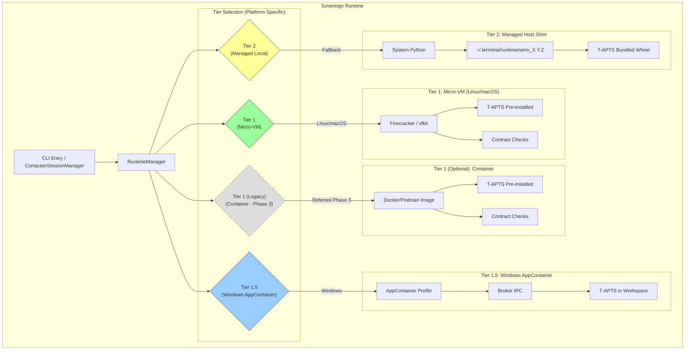

# Sovereign Runtime Architecture

> **Status**: Specification Draft  
> **Version**: 1.0.0  
> **Authors**: Principal Architecture Review  
> **Date**: 2026-01-20  
> **Supersedes**: terminai-sandbox-architecture.md (extends, does not replace)

---

## Executive Summary

TerminAI is an **Autonomous System Operator** — not a coding assistant. Its
value proposition is **governed autonomy**: the ability to diagnose, plan, and
execute system operations while maintaining deterministic safety controls.

This document defines the **Sovereign Runtime Architecture**: a multi-tiered
execution environment that guarantees TerminAI can operate reliably on **any
user's machine**, regardless of whether they have Docker, Python, or any other
dependency pre-installed.

### The Core Philosophy

```
┌─────────────────────────────────────────────────────────────────────────┐
│                      THE SOVEREIGN RUNTIME THESIS                        │
│                                                                          │
│   "Drop an agent anywhere. It learns what it has. It builds what it     │
│    needs. It executes within guardrails. It adapts or fails gracefully."│
│                                                                          │
│   We are building ENVIRONMENT-AGNOSTIC AUTONOMY for all users.          │
└─────────────────────────────────────────────────────────────────────────┘
```

### What This Achieves

| Before (Fragile)                     | After (Sovereign)                      |
| ------------------------------------ | -------------------------------------- |
| "You need Docker" → User walks away  | "I'll handle it" → User succeeds       |
| ImportError on host fallback → Crash | Managed venv with bundled deps → Works |
| Opaque upstream dependencies → Drift | Owned T-APTS package → Contract tested |
| Single execution path → Brittle      | Three-tiered fallback → Resilient      |

---

## Table of Contents

1. [Problem Statement](#1-problem-statement)
2. [Design Principles](#2-design-principles)
3. [Architecture Overview](#3-architecture-overview)
4. [Tier 1: Sovereign Sandbox (Container)](#4-tier-1-sovereign-sandbox-container)
5. [Tier 2: Managed Host Shim (Local Venv)](#5-tier-2-managed-host-shim-local-venv)
6. [Tier 3: Embedded Runtime (Future)](#6-tier-3-embedded-runtime-future)
7. [Component Design](#7-component-design)
8. [Integration with Safety Architecture](#8-integration-with-safety-architecture)
9. [Cross-Platform Compatibility](#9-cross-platform-compatibility)
10. [Influence Analysis](#10-influence-analysis)
11. [Risk Register](#11-risk-register)
12. [Implementation Specification](#12-implementation-specification)
13. [Testing & Verification](#13-testing--verification)
14. [Appendices](#appendices)

---

## 1. Problem Statement

### 1.1 The Incident

A user asked TerminAI to "clean up my downloads folder." The agent generated
Python code that crashed:

```python
AttributeError: type object 'ObjectTableLabels' has no attribute 'TRANSIT'
```

**Root Cause Chain**:

1. User on Windows without Docker → CLI fell back to host execution
2. Agent generated script importing `apts.model.ObjectTableLabels`
3. `apts` library exists in upstream Docker image but **not on user's host
   machine**
4. `PersistentShell` created a fresh venv with **no T-APTS installed**
5. Python raised `ModuleNotFoundError` → Hard crash

### 1.2 The Structural Problem

```mermaid
flowchart TB
    subgraph "Current State (Fragile)"
        CLI[CLI Entry] --> Check{Docker?}
        Check -->|Yes| Docker[Sovereign Sandbox ✅]
        Check -->|No| Host[Host Execution]
        Host --> PS[PersistentShell]
        PS --> Venv[Creates Empty Temp Venv]
        Venv --> Crash[❌ CRASH: Missing T-APTS]
    end

    style Crash fill:#f96,stroke:#333,stroke-width:3px
```



**The Gap**: `PersistentShell` creates ephemeral Python venvs for REPL sessions,
but these venvs have **no awareness** of the agent's runtime dependencies
(T-APTS).

### 1.3 Design Tension

TerminAI must serve three user personas simultaneously:

| Persona        | Environment                               | Expectation                     |
| -------------- | ----------------------------------------- | ------------------------------- |
| **Layman**     | Windows/macOS, no Docker, maybe no Python | "It just works"                 |
| **Developer**  | Docker/Podman available                   | Maximum isolation, reproducible |
| **Enterprise** | Air-gapped, policy-controlled             | Signed images, audit trail      |

A single execution strategy cannot satisfy all three. We need **adaptive runtime
selection**.

---

## 2. Design Principles

### 2.1 From AGENTS.md: The Golden Rules (Applied)

| Rule                              | Application to Sovereign Runtime                                                                                     |
| --------------------------------- | -------------------------------------------------------------------------------------------------------------------- |
| **Rule 2: Safety First**          | Host execution increases risk surface → Policy Engine must apply higher scrutiny when `runtime.isIsolated === false` |
| **Rule 4: No Bypass Paths**       | Even in Tier 2 (host), all tool execution flows through `CoreToolScheduler` → approval → audit                       |
| **Rule 5: `TERMINAI_*` Env Vars** | All runtime configuration uses `TERMINAI_*` prefix; legacy `GEMINI_*` aliases supported                              |
| **Rule 6: TypeScript Strictness** | All new runtime components use `unknown` with type guards, no `any`                                                  |

### 2.2 Agent Philosophy: Agentic Bootstrap

The best agents are those that can be **dropped anywhere** and bootstrap
themselves. This requires:

```
┌─────────────────────────────────────────────────────────────────────────┐
│                       AGENTIC BOOTSTRAP PHILOSOPHY                       │
├─────────────────────────────────────────────────────────────────────────┤
│                                                                          │
│   1. DISCOVER → What tools exist on this system?                        │
│   2. ADAPT    → Select the best execution tier for this environment     │
│   3. BOOTSTRAP→ Install missing capabilities (within guardrails)        │
│   4. EXECUTE  → Run tool code in the prepared environment               │
│   5. RECOVER  → If a capability is missing, acquire it or fail clearly  │
│                                                                          │
│   The agent owns the "how"; the user only provides the "what".          │
└─────────────────────────────────────────────────────────────────────────┘
```

### 2.3 Core Capabilities (The Survival Kit)

Every runtime tier (container or host) MUST provide these primitives:

| Category            | Capability             | Purpose                           |
| ------------------- | ---------------------- | --------------------------------- |
| **Brain**           | Python 3.10+           | Execute reasoning scripts         |
| **Library**         | T-APTS (terminai_apts) | Standard helpers for common tasks |
| **Package Manager** | pip / uv               | Install new Python tools          |
| **Network**         | curl, wget             | Download tools and data           |
| **Archive**         | tar, unzip             | Unpack downloaded tools           |
| **Process**         | ps, kill               | Manage running processes          |
| **Privilege**       | sudo check             | Know if escalation is possible    |

**Dynamic Capabilities**: Beyond the survival kit, the agent builds its own
workshop:


**Guardrails for Dynamic Install**:

- Container (Tier 1): Installations are ephemeral; container restart resets
- Host (Tier 2): `apt-get install` requires Level B approval; `pip install` is
  Level A if inside managed venv

---

## 3. Architecture Overview

### 3.1 Multi-Tiered Execution Strategy

> **Architecture Evolution Note**: The tier priority order has evolved based on
> Phase 1.5 Micro-VM implementation and Windows AppContainer development. See
> Section 6 for Micro-VM details and Appendix M for Windows architecture.



### 3.2 Tier Summary (Current Implementation)

| Tier    | Name                      | Technology                   | When Used                        | T-APTS Source                    | Status       |
| ------- | ------------------------- | ---------------------------- | -------------------------------- | -------------------------------- | ------------ |
| **1**   | Micro-VM                  | Firecracker / vfkit          | Linux/macOS (preferred)          | Pre-installed in guest           | ✅ Phase 1.5 |
| **1.5** | Windows AppContainer      | AppContainer + Broker        | Windows (preferred)              | Bundled in workspace             | ✅ Phase 2   |
| **1†**  | Container (Optional)      | Docker/Podman Container      | User prefers Docker              | Pre-installed in image           | 🔄 Phase 3   |
| **2**   | Managed Host Shim         | System Python + Managed Venv | Fallback (explicit user consent) | Bundled wheel in CLI npm package | ✅ Phase 1   |
| **3**   | Embedded Runtime (Future) | PyOxidizer/Bundled Python    | No Python installed              | Embedded in binary               | 📅 Future    |

**† Container (Docker/Podman)**: Originally designed as Tier 1, now deferred to
Phase 3 as an **optional isolation tier** for users who explicitly prefer Docker
over Micro-VM. Micro-VM provides better isolation with lower overhead and no
Docker dependency. See Section 4 for legacy documentation and rationale for
deferral.

### 3.3 Data Flow (Complete)


---

## 4. Tier 1 (Legacy): Sovereign Sandbox (Container)

> **Status**: Deferred to Phase 3 (Optional Enhancement)  
> **Superseded By**: Micro-VM (Section 6) and Windows AppContainer (Appendix M)

### 4.1 Overview

> [!NOTE] This section documents the **original** Tier 1 design using
> Docker/Podman containers. During architecture evolution, Micro-VM emerged as a
> superior isolation mechanism with lower overhead and no external dependency on
> Docker daemon. **Container support is now planned as an optional Tier 1
> variant for Phase 3**, targeting users who explicitly prefer Docker-based
> execution.

The container-based execution environment provides:

- Complete isolation from host system
- Reproducible, immutable environment
- Pre-installed T-APTS with contract guarantees
- CI-tested before every release

**Why Deferred**: Micro-VM (Firecracker on Linux, vfkit on macOS) boots faster
(<200ms), uses less memory (~50MB vs ~200MB), and doesn't require Docker Desktop
installation. Windows AppContainer provides native trusted sandboxing without
containers.

### 4.2 Current State (Already Implemented)

| Component          | Location                                            | Status             |
| ------------------ | --------------------------------------------------- | ------------------ |
| Dockerfile         | `packages/sandbox-image/Dockerfile`                 | ✅ Implemented     |
| T-APTS Package     | `packages/sandbox-image/python/terminai_apts/`      | ✅ Implemented     |
| Legacy `apts` Shim | `packages/sandbox-image/python/apts/`               | ✅ Implemented     |
| Contract Checks    | `packages/sandbox-image/scripts/contract_checks.sh` | ✅ Implemented     |
| Entrypoint         | `packages/sandbox-image/scripts/entrypoint.sh`      | ✅ Implemented     |
| CLI Health Check   | `packages/cli/src/utils/sandboxHealthCheck.ts`      | ✅ Implemented     |
| Image Registry     | `ghcr.io/prof-harita/terminai/sandbox:X.Y.Z`        | ✅ GHCR configured |

### 4.3 Image Contents

```dockerfile
# packages/sandbox-image/Dockerfile (abbreviated)
FROM docker.io/library/node:20-slim

# OS Tools (Survival Kit)
RUN apt-get update && apt-get install -y --no-install-recommends \
    python3 python3-pip python3-venv \
    curl jq git unzip ...

# TerminAI CLI
COPY packages/cli/dist/terminai-cli-*.tgz /tmp/
RUN npm install -g /tmp/terminai-cli-*.tgz

# T-APTS (Contract-Tested Python Library)
COPY packages/sandbox-image/python /tmp/terminai-apts
RUN python3 -m venv /opt/terminai/venv \
 && /opt/terminai/venv/bin/pip install /tmp/terminai-apts

# Contract Checks at Startup
COPY packages/sandbox-image/scripts/entrypoint.sh /opt/terminai/
ENTRYPOINT ["/opt/terminai/entrypoint.sh"]
```

### 4.4 Contract Testing

Before any image is published, CI runs:

```bash
#!/bin/bash
# packages/sandbox-image/scripts/contract_checks.sh

python3 -c "import terminai_apts; print('T-APTS OK')"
python3 -c "
from terminai_apts.model import ObjectTableLabels
assert hasattr(ObjectTableLabels, 'TRANSIT'), 'Missing TRANSIT'
assert hasattr(ObjectTableLabels, 'KEEP'), 'Missing KEEP'
assert hasattr(ObjectTableLabels, 'DELETE'), 'Missing DELETE'
print('Contract checks passed')
"
```

**CI Gate**: `.github/actions/push-sandbox/action.yml` runs contract checks
before pushing to GHCR.

---

## 5. Tier 2: Managed Host Shim (Local Venv)

### 5.1 Overview

For users without Docker, the **Managed Host Shim** provides a reliable
fallback:

- Uses system Python (3.10+)
- Creates a **version-scoped, persistent venv** at
  `~/.terminai/runtime/venv_X.Y.Z`
- Installs T-APTS from a **bundled wheel** (no network required after CLI
  install)
- Provides the same `RuntimeContext` interface as Tier 1

### 5.2 Why Version-Scoped Venvs?

A single persistent venv (`~/.terminai/runtime/venv`) creates problems:

| Problem                                | Solution                                           |
| -------------------------------------- | -------------------------------------------------- |
| T-APTS version drift after CLI upgrade | Each CLI version creates `venv_X.Y.Z`              |
| User-installed packages conflict       | Agent venv is isolated from user python            |
| Disk sprawl from old versions          | Prune venvs older than 2 major versions on startup |

### 5.3 Bootstrap Sequence


### 5.4 Bundled Wheel Strategy

Instead of downloading T-APTS from PyPI (which requires network and introduces
version coordination issues), the CLI npm package **bundles the wheel**:

```
packages/cli/
├── dist/
│   └── terminai_apts-0.28.0-py3-none-any.whl  # Bundled at build time
├── package.json
│   └── "files": ["dist/*.whl", ...]
└── src/sandbox/
    └── ManagedLocalRuntime.ts
        // this.bundledWheelPath = path.join(__dirname, '..', 'dist', 'terminai_apts-*.whl')
```

**Benefits**:

- ✅ Offline installation (no network needed after npm install)
- ✅ Version synchronization (wheel version = CLI version)
- ✅ Fast bootstrap (~0.5s instead of ~3s for PyPI download)
- ✅ No PyPI outage dependency

### 5.5 First-Run Warning

When Tier 2 is selected, display a **one-time, dismissible warning**:

```
┌─────────────────────────────────────────────────────────────────┐
│  ⚠️  Running in Host Mode (Tier 2)                              │
│                                                                  │
│  Docker is not available. TerminAI will use your system Python. │
│  For better isolation, install Docker: https://docs.docker.com  │
│                                                                  │
│  [Got it, don't show again]                                     │
└─────────────────────────────────────────────────────────────────┘
```

---

## 6. Tier 1.5: Micro-VM (Phase 1.5 Priority)

### 6.1 The "Safe by Default" Strategy

**Status**: Critical Path (Phase 1.5)  
**Objective**: Replace "Managed Host Shim" as the default for users without
Docker.

Relying on Host Mode (Tier 2) exposes users to risk and triggers Anti-Virus (AV)
heuristics. To solve this, we will bundle a **Micro-VM** based on the "BoxLite"
pattern (using KVM/Hyper-V/Virtualization.framework).

### 6.2 Why Micro-VM Solves the AV Risk

**The "Malware Signature" Problem**:

- **Host Mode Agent**: Downloads executables, spawns shells, modifies files.
  - _Defender Perspective_: "Suspicious behavior (Trojan/Dropper)."
- **Micro-VM Agent**: Launches a single Hypervisor API call.
  - _Defender Perspective_: "Legitimate virtualization process (like
    WSL2/Docker)."

**Behavioral Hiding**:

- All "suspicious" activity (tool downloading, pip install, shell execution)
  happens **inside the guest kernel**.
- Host AV cannot introspect the guest memory or filesystem efficiently.
- The host sees only a single, stable process using standard virtualization
  APIs.

### 6.3 Implementation Plan

**Technology Stack**:

- **Linux**: KVM (Kernel-based Virtual Machine) via `firecracker` or
  `cloud-hypervisor`
- **Windows**: Hyper-V via `cloud-hypervisor` or `hcsshim`
- **macOS**: `Virtualization.framework` (native)

**The "Agent Zero" Binary**: Instead of just a CLI, the Phase 1.5 binary will
include a minimal Rust wrapper that:

1. Detects OS virtualization support.
2. Boots a minimal Linux kernel (~10MB) in <200ms.
3. Mounts the workspace via virtio-fs.
4. Executes the Agent Runtime inside the VM.

**Roadmap Impact**:

- **Phase 1 (Now)**: Docker (Tier 1) + Host Fallback (Tier 2) with "Unsafe"
  warning.
- **Phase 1.5 (Next)**: Release Micro-VM bundle. Tier 2 becomes "Legacy/Expert
  Only".

```typescript
async function getContext(): Promise<RuntimeContext> {
  if (await this.isContainerAvailable()) return new ContainerRuntime();
  if (await this.isSystemPythonAvailable()) return new ManagedLocalRuntime();
  // Future:
  if (this.hasBundledPython()) return new EmbeddedRuntime();

  throw new FatalRuntimeError(
    'Python 3.10+ required. Install from https://python.org',
  );
}
```

---

## 7. Component Design

### 7.1 New Components

#### 7.1.1 `RuntimeContext` Interface

**Location**: `packages/core/src/computer/RuntimeContext.ts`

```typescript
/**
 * RuntimeContext provides a uniform interface for different execution tiers.
 *
 * The core package only depends on this interface, allowing the CLI to inject
 * the appropriate runtime without creating circular dependencies.
 */
export interface RuntimeContext {
  /** 'container' (Tier 1) or 'local' (Tier 2/3) */
  readonly type: 'container' | 'local';

  /** Whether execution is isolated (container or venv) */
  readonly isIsolated: boolean;

  /** Human-readable name for logging/telemetry */
  readonly displayName: string;

  /** Full path to python executable */
  readonly pythonPath: string;

  /** T-APTS version available in this runtime */
  readonly taptsVersion: string;

  /** Perform health check on the runtime */
  healthCheck(): Promise<{ ok: boolean; error?: string }>;

  /** Clean up resources (if any) */
  dispose(): Promise<void>;
}
```

#### 7.1.2 `RuntimeManager` Class

**Location**: `packages/cli/src/sandbox/RuntimeManager.ts`

```typescript
export class RuntimeManager {
  private readonly cliVersion: string;
  private cachedContext?: RuntimeContext;

  constructor(cliVersion: string) {
    this.cliVersion = cliVersion;
  }

  /**
   * Returns the best available runtime for this system.
   * Priority: Docker > Podman > Managed Local
   */
  async getContext(): Promise<RuntimeContext> {
    if (this.cachedContext) return this.cachedContext;

    const containerCmd = await this.findContainerCommand();
    if (containerCmd) {
      this.cachedContext = new ContainerRuntimeContext(
        containerCmd,
        this.getSandboxImageUri(),
      );
    } else if (await this.isSystemPythonAvailable()) {
      this.cachedContext = await this.bootManagedLocalRuntime();
    } else {
      throw new FatalRuntimeError(
        'No execution runtime available. ' +
          'Install Docker (https://docs.docker.com) or Python 3.10+ (https://python.org)',
      );
    }

    // Prune old venvs on startup (fire-and-forget)
    this.pruneOldVenvs().catch(debugLogger.warn);

    return this.cachedContext;
  }

  private async bootManagedLocalRuntime(): Promise<LocalRuntimeContext> {
    const venvPath = path.join(
      os.homedir(),
      '.terminai',
      'runtime',
      `venv_${this.cliVersion}`,
    );

    if (!(await this.isVenvValid(venvPath))) {
      await this.createVenv(venvPath);
      await this.installBundledWheel(venvPath);
    }

    return new LocalRuntimeContext(venvPath, this.cliVersion);
  }
}
```

#### 7.1.3 Updated `PersistentShell`

**Location**: `packages/core/src/computer/PersistentShell.ts`

**Change**: Add optional `pythonPath` to skip internal venv creation:

```typescript
export interface PersistentShellOptions {
  language: 'python' | 'shell' | 'node';
  cwd: string;
  env?: Record<string, string>;
  pythonPath?: string; // NEW: Override python executable
  onOutput: (data: string) => void;
  onExit: (code: number | null, signal: number | null) => void;
}
```

```typescript
// In spawn() method:
case 'python':
  if (this.options.pythonPath) {
    // Use provided python (from RuntimeContext)
    command = this.options.pythonPath;
    args = ['-i', '-u'];
    // Skip venv creation — caller guarantees T-APTS is available
  } else {
    // Legacy ephemeral venv flow (backward compatibility)
    this.tempVenvPath = fs.mkdtempSync(...);
    // ... existing code
  }
  break;
```

### 7.2 File Structure Changes

```
packages/cli/src/
├── sandbox/                      # NEW: Runtime management
│   ├── RuntimeManager.ts         # Orchestrator
│   ├── ContainerRuntimeContext.ts   # Tier 1
│   └── LocalRuntimeContext.ts    # Tier 2
├── utils/
│   ├── sandbox.ts                # (existing, uses RuntimeManager)
│   └── sandboxHealthCheck.ts     # (existing)
└── dist/
    └── terminai_apts-*.whl       # NEW: Bundled at build time

packages/core/src/
├── computer/
│   ├── RuntimeContext.ts         # NEW: Interface (shared contract)
│   ├── PersistentShell.ts        # MODIFIED: accepts pythonPath
│   └── ComputerSessionManager.ts # MODIFIED: accepts RuntimeContext
└── index.ts                      # Export RuntimeContext interface
```

---

## 8. Integration with Safety Architecture

### 8.1 Three-Axis Model + Runtime

The Sovereign Runtime **does not bypass** the safety architecture. All tool
execution still flows through:

```
Tool Call → Provenance Tagging → ActionProfile → Three-Axis Classification
         → computeMinimumReviewLevel() → Approval → Audit → Execute
```

However, the **runtime type influences risk classification**:

| Runtime                | `isIsolated` | Effect on Safety                        |
| ---------------------- | ------------ | --------------------------------------- |
| Tier 1 (Container)     | `true`       | Standard review levels apply            |
| Tier 2 (Managed Local) | `false`      | Elevated scrutiny for system operations |

### 8.2 Policy Engine Integration

New policy conditions for runtime awareness:

```typescript
// In computeMinimumReviewLevel.ts or policy engine
if (!runtimeContext.isIsolated) {
  // Host execution: bump anything touching system paths to Level B minimum
  if (actionProfile.targetPaths.some(isSystemPath)) {
    return Math.max(reviewLevel, 'B');
  }
}
```

### 8.3 Audit Trail Enhancement

Audit events now include runtime context:

```typescript
interface AuditEvent {
  // ... existing fields
  runtime: {
    type: 'container' | 'local';
    tier: 1 | 2 | 3;
    isolated: boolean;
    pythonVersion?: string;
    taptsVersion?: string;
  };
}
```

---

## 9. Cross-Platform Compatibility

### 9.1 OS Compatibility Matrix

| OS                  | Default Tier | Docker Availability                | Python Typically Available | Notes                                        |
| ------------------- | ------------ | ---------------------------------- | -------------------------- | -------------------------------------------- |
| **Linux (Desktop)** | Tier 1       | Common                             | Yes                        | Docker usually pre-installed on dev machines |
| **Linux (Server)**  | Tier 1       | Very Common                        | Yes                        | Production default                           |
| **macOS**           | Tier 1       | Common (Docker Desktop / OrbStack) | Yes (system Python)        | May need Rosetta for ARM                     |
| **Windows**         | Tier 2       | Uncommon                           | Via python.org             | Most laymen won't have Docker                |
| **WSL2**            | Tier 1       | Common                             | Yes                        | Best Windows experience                      |

### 9.2 Python Discovery (Tier 2)

```typescript
function findPythonExecutable(): string | null {
  const candidates = [
    'python3',
    'python',
    '/usr/bin/python3',
    '/usr/local/bin/python3',
    // Windows
    'C:\\Python312\\python.exe',
    'C:\\Python311\\python.exe',
    'C:\\Python310\\python.exe',
    // pyenv
    path.join(os.homedir(), '.pyenv', 'shims', 'python3'),
    // Environment variable override
    process.env['TERMINAI_PYTHON_PATH'],
  ];

  for (const cmd of candidates) {
    if (cmd && shutil.which(cmd)) {
      const version = getPythonVersion(cmd);
      if (version && semver.gte(version, '3.10.0')) {
        return cmd;
      }
    }
  }
  return null;
}
```

### 9.3 Windows-Specific Considerations

| Challenge                             | Solution                                      |
| ------------------------------------- | --------------------------------------------- |
| No `python3` command (just `python`)  | Check both `python3` and `python`             |
| Venv scripts in `Scripts/` not `bin/` | Platform-aware path construction              |
| PowerShell execution policy           | Use `python.exe` directly, not `activate.ps1` |
| Long paths (>260 chars)               | Use short path for venv location              |

---

## 10. Influence Analysis

### 10.1 What Changes, What Stays

| Component                                              | Influence | Change Required                                                 |
| ------------------------------------------------------ | --------- | --------------------------------------------------------------- |
| `packages/cli/src/utils/sandbox.ts`                    | High      | Call `RuntimeManager.getContext()` before `start_sandbox()`     |
| `packages/core/src/computer/PersistentShell.ts`        | Medium    | Add `pythonPath` option, use it when provided                   |
| `packages/core/src/computer/ComputerSessionManager.ts` | Medium    | Accept `RuntimeContext`, pass `pythonPath` to `PersistentShell` |
| `packages/cli/src/gemini.tsx`                          | Low       | Initialize `RuntimeManager` on startup                          |
| `packages/core/src/safety/approval-ladder/*`           | Low       | Optional: Add `runtime.isIsolated` to risk factors              |
| `packages/core/src/audit/ledger.ts`                    | Low       | Add `runtime` field to audit events                             |
| `packages/cli/package.json`                            | Low       | Add `dist/*.whl` to `files` array                               |
| `esbuild.config.js` / build scripts                    | Low       | Copy wheel to dist on build                                     |

### 10.2 Regression Risks

| Risk                                          | Mitigation                                                                        |
| --------------------------------------------- | --------------------------------------------------------------------------------- |
| Breaking existing Docker-based sandbox flow   | RuntimeManager defaults to container when available; existing code path unchanged |
| PersistentShell regression                    | `pythonPath` is optional; existing ephemeral venv flow is preserved               |
| T-APTS wheel not bundled correctly            | CI step to verify wheel exists in dist before publish                             |
| Venv creation fails on exotic Python installs | Clear error message with remediation: "Python 3.10+ required"                     |
| Windows path issues                           | Comprehensive Windows testing in CI matrix                                        |

---

## 11. Risk Register

### 11.1 Security Risks

| Risk                                                 | Severity | Probability         | Mitigation                                                                                                                                                  |
| ---------------------------------------------------- | -------- | ------------------- | ----------------------------------------------------------------------------------------------------------------------------------------------------------- |
| **Host code execution less isolated than container** | High     | Certain (by design) | (1) Policy Engine applies elevated scrutiny when `!isIsolated` (2) Dismissible first-run warning recommends Docker (3) Audit logs tag all Tier 2 executions |
| **Malicious LLM suggestion harms host files**        | High     | Low                 | Approval Ladder still applies; Level B/C for dangerous operations                                                                                           |
| **Bundled wheel supply chain attack**                | Medium   | Very Low            | Wheel is built from repo source; signed with cosign in CI                                                                                                   |

### 11.2 Reliability Risks

| Risk                                             | Severity | Probability | Mitigation                                                        |
| ------------------------------------------------ | -------- | ----------- | ----------------------------------------------------------------- |
| **System Python incompatible (version too old)** | Medium   | Low         | Check version before venv creation; clear error message           |
| **venv/pip fails on exotic systems**             | Medium   | Low         | Fallback to error with manual remediation steps                   |
| **Wheel file corrupted in npm package**          | Low      | Very Low    | SHA256 verification on first install                              |
| **Version drift between CLI and T-APTS**         | Low      | Very Low    | Wheel version embedded in CLI package.json; version check on boot |

### 11.3 Usability Risks

| Risk                                                  | Severity | Probability | Mitigation                                                 |
| ----------------------------------------------------- | -------- | ----------- | ---------------------------------------------------------- |
| **User confused by "no Docker" warning**              | Low      | Medium      | Warning is dismissible + educates about benefits of Docker |
| **venv_X.Y.Z folders accumulate**                     | Low      | Low         | Automatic pruning of venvs older than 2 major versions     |
| **Longer startup time on first run (venv bootstrap)** | Low      | Certain     | Progress indicator; subsequent runs use cached venv        |

---

## 12. Implementation Specification

### 12.1 Phase 1: Foundation (Critical Path)

**Goal**: Make host fallback not crash.

| Task                                              | File                                                   | Effort | Priority |
| ------------------------------------------------- | ------------------------------------------------------ | ------ | -------- |
| Create `RuntimeContext` interface                 | `packages/core/src/computer/RuntimeContext.ts`         | 0.5h   | P0       |
| Add `pythonPath` to `PersistentShellOptions`      | `packages/core/src/computer/PersistentShell.ts`        | 0.5h   | P0       |
| Create `RuntimeManager`                           | `packages/cli/src/sandbox/RuntimeManager.ts`           | 2h     | P0       |
| Create `LocalRuntimeContext`                      | `packages/cli/src/sandbox/LocalRuntimeContext.ts`      | 1h     | P0       |
| Bundle T-APTS wheel in CLI                        | Build scripts, `package.json`                          | 1h     | P0       |
| Wire `RuntimeManager` into CLI startup            | `packages/cli/src/gemini.tsx`                          | 0.5h   | P0       |
| Pass `RuntimeContext` to `ComputerSessionManager` | `packages/core/src/computer/ComputerSessionManager.ts` | 0.5h   | P0       |

**Total Critical Path**: ~6 hours

### 12.2 Phase 2: Polish

| Task                                           | File                        | Effort |
| ---------------------------------------------- | --------------------------- | ------ |
| Add first-run warning for Tier 2               | `packages/cli/src/ui/`      | 1h     |
| Add venv pruning logic                         | `RuntimeManager.ts`         | 0.5h   |
| Add `runtime` field to audit events            | `packages/core/src/audit/`  | 0.5h   |
| Optional: Elevate review for host+system paths | `packages/core/src/safety/` | 1h     |
| Update docs                                    | `docs-terminai/`            | 1h     |

### 12.3 Phase 3: Hardening (Future Sprint)

| Task                                   | Effort   |
| -------------------------------------- | -------- |
| E2E tests for Tier 2 bootstrap         | 2h       |
| Windows CI matrix testing              | 2h       |
| Tier 3 (embedded Python) investigation | Research |

---

## 13. Testing & Verification

### 13.1 Unit Tests

**New Tests Required**:

| Test                                  | Location                                               | Coverage                                              |
| ------------------------------------- | ------------------------------------------------------ | ----------------------------------------------------- |
| `RuntimeManager` tier selection       | `packages/cli/src/sandbox/RuntimeManager.test.ts`      | Container available → Tier 1; No container → Tier 2   |
| `LocalRuntimeContext` venv bootstrap  | `packages/cli/src/sandbox/LocalRuntimeContext.test.ts` | Creates venv, installs wheel, provides pythonPath     |
| `PersistentShell` pythonPath override | `packages/core/src/computer/PersistentShell.test.ts`   | When pythonPath provided, skip internal venv creation |

### 13.2 Integration Tests

**Existing Tests to Verify**:

```bash
# packages/cli health check tests
npm test -- packages/cli/src/utils/sandboxHealthCheck.test.ts

# packages/core PersistentShell tests
npm test -- packages/core/src/computer/PersistentShell.test.ts

# packages/core ComputerSessionManager tests
npm test -- packages/core/src/computer/ComputerSessionManager.test.ts
```

**New E2E Test** (Docker-based, safe for CI):

```typescript
// packages/cli/src/sandbox/__integration__/tier2-bootstrap.test.ts
describe('Tier 2 Bootstrap', () => {
  it('creates venv and installs T-APTS when Docker unavailable', async () => {
    // Mock Docker as unavailable
    vi.mock('child_process', () => ({
      execSync: vi.fn().mockImplementation((cmd) => {
        if (cmd.includes('docker')) throw new Error('Docker not found');
        return '';
      }),
    }));

    const manager = new RuntimeManager('0.28.0');
    const context = await manager.getContext();

    expect(context.type).toBe('local');
    expect(context.pythonPath).toContain('venv_0.28.0');

    // Verify T-APTS is importable
    const result = await context.healthCheck();
    expect(result.ok).toBe(true);
  });
});
```

### 13.3 Manual Verification

**Test Matrix**:

| Environment                 | Steps                                      | Expected Result                                                               |
| --------------------------- | ------------------------------------------ | ----------------------------------------------------------------------------- |
| Ubuntu 22.04 + Docker       | `terminai -p "List files"`                 | Tier 1 selected, sandbox health check passes                                  |
| Ubuntu 22.04 without Docker | (remove Docker) `terminai -p "List files"` | Tier 2 selected, venv created, T-APTS works                                   |
| Windows 11 + Python 3.11    | `terminai -p "List files"`                 | Tier 2 selected, venv created at `%USERPROFILE%\.terminai\runtime\venv_X.Y.Z` |
| macOS + OrbStack            | `terminai -p "List files"`                 | Tier 1 selected                                                               |

---

## Appendices

### Appendix A: Environment Variables

| Variable                             | Purpose                                               | Default                                      |
| ------------------------------------ | ----------------------------------------------------- | -------------------------------------------- |
| `TERMINAI_SANDBOX`                   | Force sandbox mode (`docker`/`podman`/`true`/`false`) | Auto-detect                                  |
| `TERMINAI_SANDBOX_IMAGE`             | Override container image URI                          | `ghcr.io/prof-harita/terminai/sandbox:X.Y.Z` |
| `TERMINAI_PYTHON_PATH`               | Override Python executable for Tier 2                 | Auto-detect                                  |
| `TERMINAI_SKIP_SANDBOX_HEALTH_CHECK` | Skip CLI-side health check                            | `false`                                      |
| `TERMINAI_SKIP_CONTRACT_CHECKS`      | Skip in-container contract checks                     | `false`                                      |
| `TERMINAI_RUNTIME_TIER`              | Force specific tier (debugging)                       | Auto-select                                  |

### Appendix B: Upgrade Path

**From 0.27.x to 0.28.x (with Tier 2)**:

1. Users with Docker: No change (Tier 1 continues to work)
2. Users without Docker:
   - First run creates `~/.terminai/runtime/venv_0.28.0/`
   - Subsequent runs use cached venv
   - On upgrade to 0.29.0, new venv created, old pruned on startup

### Appendix C: Telemetry Points

| Event                         | Data Captured                 | Purpose                                  |
| ----------------------------- | ----------------------------- | ---------------------------------------- |
| `runtime.selected`            | `{tier, type, pythonVersion}` | Understand user environment distribution |
| `runtime.bootstrap.duration`  | Milliseconds                  | Optimize cold-start                      |
| `runtime.healthcheck.failure` | Error message                 | Identify common setup issues             |

### Appendix D: Glossary

| Term                  | Definition                                                                        |
| --------------------- | --------------------------------------------------------------------------------- |
| **T-APTS**            | TerminAI Python Tool Set — the repo-owned Python library replacing opaque `apts`  |
| **Sovereign Sandbox** | Docker container built from this repo with pre-installed, contract-tested T-APTS  |
| **Managed Host Shim** | System Python + persistent venv with bundled T-APTS wheel                         |
| **RuntimeContext**    | Interface exposing `pythonPath`, `isIsolated`, etc. to execution layer            |
| **RuntimeManager**    | CLI component that selects and bootstraps the appropriate runtime tier            |
| **Contract Checks**   | Python assertions that required symbols (e.g., `ObjectTableLabels.TRANSIT`) exist |

### Appendix E: The Runtime Paradox — Security vs Utility Taxonomy

The core architectural tension in any autonomous agent is the **Runtime
Paradox**:

> _To be useful, an agent needs broad permissions; to be safe, it needs strict
> isolation._

TerminAI rejects the binary choice by implementing a **tiered sovereignty
model**:

| Model                | Agent Analogy                                     | Example                      | TerminAI Position        |
| -------------------- | ------------------------------------------------- | ---------------------------- | ------------------------ |
| **Ghost Machine**    | Lives in parallel universe, cannot affect reality | Anthropic Docker "demo"      | ❌ Rejected — not useful |
| **Roommate**         | Lives in your house, has keys to everything       | Cline, Open Interpreter      | ❌ Rejected — dangerous  |
| **Sovereign Tenant** | Lives on your property, controlled access         | TerminAI (this architecture) | ✅ Adopted               |

**The Sovereign Tenant Model**:

- **Host Presence**: Agent runs on host (not in isolated demo container)
- **Controlled Access**: Policy Engine gates what the agent can touch
- **Isolated Execution**: Untrusted code runs in sandboxed tier
- **Persistent Memory**: Agent retains context across sessions
- **Audit Trail**: Every action is logged immutably


### Appendix F: Agent Zero — Self-Sufficient Binary Distribution

The **Bootstrap Problem**: How does an agent start working on a machine with
nothing installed?

| Distribution Model          | Bootstrap Friction                        | Example              | TerminAI Strategy |
| --------------------------- | ----------------------------------------- | -------------------- | ----------------- |
| Python script               | High — requires Python, pip, dependencies | Open Interpreter     | ❌ Avoid          |
| npm package                 | Medium — requires Node.js                 | Current TerminAI CLI | Current state     |
| Bundled binary              | Low — single executable                   | Goose                | Target state      |
| Self-extracting + provision | Zero — works anywhere                     | Agent Zero ideal     | Future            |

**The Agent Zero Requirement**:

TerminAI should be distributable as a **single, statically linked binary** that:

1. **Carries its own survival kit** — essential tools bundled (jq, curl shim,
   Python wheel)
2. **Provisions on first run** — detects OS, creates `~/.terminai/` workspace
3. **Does not pollute host** — all dependencies in private folder
4. **Upgrades atomically** — new binary replaces old, migrates state

**Implementation Path**:

| Phase       | Distribution                           | Dependencies         |
| ----------- | -------------------------------------- | -------------------- |
| **Current** | npm package (`npm i -g @terminai/cli`) | Requires Node.js 20+ |
| **Phase 2** | SEA binary (Node.js Single Executable) | Self-contained       |
| **Phase 3** | Rust CLI wrapper + bundled Node.js     | True Agent Zero      |

See [Building Binaries](./building_binaries.md) for SEA implementation details.

### Appendix G: Policy Engine Safe Zones

Rather than asking for approval on **every action** (which creates click
fatigue), TerminAI implements **Safe Zones** — pre-approved permission
boundaries.

**Zone Definitions**:

| Zone          | Paths                          | Default Permission               | Upgrade Trigger             |
| ------------- | ------------------------------ | -------------------------------- | --------------------------- |
| **Workspace** | Current project directory      | Read/Write (Level A)             | —                           |
| **User Home** | `~/Documents`, `~/Downloads`   | Read (A), Write (B)              | Creating new directories    |
| **Config**    | `~/.config`, `~/.terminai`     | Read (A), Write (A)              | Touching other apps' config |
| **System**    | `/etc`, `/usr`, `/var`         | Deny                             | Explicit user grant         |
| **Secrets**   | `~/.ssh`, `~/.gnupg`, `~/.aws` | Read (C), Write (Deny)           | Never auto-granted          |
| **External**  | Network requests               | Trusted domains (A), Unknown (B) | New domain → prompt         |

**Safe Zone Configuration** (future settings.json schema):

```json
{
  "policy": {
    "safeZones": {
      "workspace": { "read": "A", "write": "A", "execute": "B" },
      "userHome": { "read": "A", "write": "B", "delete": "C" },
      "secrets": { "read": "C", "write": "DENY" }
    },
    "trustedDomains": ["github.com", "npmjs.org", "pypi.org"],
    "blockedCommands": ["rm -rf /", "mkfs", "dd if="]
  }
}
```

**Zone Enforcement Flow**:

```mermaid
flowchart TB
    Action[Agent Intent: Write to ~/.ssh/config] --> Zone{Zone Classification}
    Zone --> Secrets[Zone: Secrets]
    Secrets --> Policy{Policy Check}
    Policy --> WriteSecrets["write: DENY"]
    WriteSecrets --> Block[❌ Action Blocked]
    Block --> Explain["Cannot modify SSH config. This is a protected secrets zone."]

    style Block fill:#f96,stroke:#333
```



### Appendix H: MCP Compatibility and Hybrid Tooling

The **Model Context Protocol (MCP)** is an emerging standard for tool
interoperability. TerminAI adopts a **hybrid tooling strategy**:

| Tool Type             | Protocol | Why                         | Examples                        |
| --------------------- | -------- | --------------------------- | ------------------------------- |
| **Core (Effectors)**  | Native   | Low latency, OS integration | Mouse, Keyboard, Shell, PTY     |
| **Extensions (Mind)** | MCP      | Ecosystem leverage          | GitHub, Slack, Database, Search |

**Why Not All MCP?**

MCP adds serialization latency (~5-20ms per call). For high-frequency operations
(mouse tracking at 100Hz, shell output streaming), this is unacceptable.

**MCP Integration Architecture**:


**Existing MCP Support**: TerminAI already supports MCP servers via
`settings.json`:

```json
{
  "mcpServers": {
    "github": {
      "command": "mcp-server-github",
      "args": []
    }
  }
}
```

**No changes needed for Sovereign Runtime** — MCP servers operate at the LLM
tool layer, orthogonal to execution tier.

### Appendix I: Multimodal Sensorium — Accessibility-First Sensing

TerminAI's primary sensing modality is **text-based** (see
[Why PTY](./why-pty.md)), but a complete "Cowork" agent needs a **multimodal
sensorium**:

| Sensor                 | Modality        | Token Cost      | Latency | TerminAI Priority    |
| ---------------------- | --------------- | --------------- | ------- | -------------------- |
| **PTY/Stdout**         | Text            | ~200 tokens/cmd | ~50ms   | Primary              |
| **Accessibility Tree** | Structured Text | ~50-200 tokens  | ~10ms   | Future Primary (GUI) |
| **Screenshot**         | Vision          | ~3,000+ tokens  | ~1-2s   | Fallback             |

**The Accessibility Tree Advantage**:

Every modern OS exposes an accessibility API for screen readers:

| OS              | API               | Example Output                                                    |
| --------------- | ----------------- | ----------------------------------------------------------------- |
| **Windows**     | UI Automation     | `{type: "Button", name: "Save", state: "enabled", bounds: {...}}` |
| **macOS**       | Accessibility API | `AXButton: "Save", AXEnabled: true`                               |
| **Linux/GNOME** | AT-SPI            | Similar structured data                                           |

This gives the agent **exact coordinates and semantic labels** without vision
model inference.

**Tiered Sensorium Architecture**:


**Implementation Path**:

| Phase       | GUI Capability      | Sensing                       |
| ----------- | ------------------- | ----------------------------- |
| **Current** | None (CLI only)     | PTY                           |
| **Phase 2** | Desktop app (Tauri) | PTY + limited A11y            |
| **Phase 3** | Full GUI automation | A11y primary, Vision fallback |

### Appendix J: Micro-VM Isolation (BoxLite Alternative)

Docker is not the only isolation option. For faster, lighter sandboxing,
consider **Micro-VMs**:

| Technology          | Startup Time | Isolation Level        | Root Required | TerminAI Fit          |
| ------------------- | ------------ | ---------------------- | ------------- | --------------------- |
| **Docker**          | ~1-3s        | Container (namespaces) | Yes (daemon)  | Current Tier 1        |
| **Podman**          | ~1-3s        | Container (rootless)   | No            | Current Tier 1        |
| **Firecracker**     | ~125ms       | Full VM (KVM)          | Yes           | Future Tier 1.5       |
| **BoxLite** (Goose) | ~100ms       | Micro-VM (KVM)         | No            | Future consideration  |
| **gVisor**          | ~500ms       | User-space kernel      | No            | Enterprise option     |
| **WASM**            | ~10ms        | Language sandbox       | No            | Script-only isolation |

**When to Use Micro-VM**:

| Scenario                             | Docker          | Micro-VM           |
| ------------------------------------ | --------------- | ------------------ |
| Running untrusted downloaded code    | ✅              | ✅ (faster)        |
| Long-running development environment | ✅ (persistent) | ⚠️ (ephemeral)     |
| CI/CD pipeline                       | ✅ (ecosystem)  | ✅ (speed)         |
| User's machine without Docker        | ❌              | BoxLite could work |

**Potential Tier 1.5**: If Goose's BoxLite matures, TerminAI could add:

```typescript
// Future RuntimeManager.getContext():
if (await this.isDockerAvailable()) return new ContainerRuntime();
if (await this.isBoxLiteAvailable()) return new MicroVMRuntime(); // NEW
if (await this.isSystemPythonAvailable()) return new ManagedLocalRuntime();
```

**For current sprint**: Docker/Podman Tier 1 is sufficient. Micro-VM is
architectural future-proofing.

### Appendix K: Comparative Architecture Table

Benchmarking TerminAI's Sovereign Runtime against the "Cowork" ecosystem:

| Feature                | Anthropic Demo       | Cline                   | Open Interpreter       | Goose                 | **TerminAI**                                |
| ---------------------- | -------------------- | ----------------------- | ---------------------- | --------------------- | ------------------------------------------- |
| **Isolation Model**    | Docker (Ghost)       | None (Roommate)         | None (Roommate)        | Micro-VM (BoxLite)    | **Tiered (Sovereign)**                      |
| **Persistence**        | Ephemeral            | Workspace files         | Session (RAM)          | Local DB              | **Vector + Session**                        |
| **Tooling Protocol**   | Native (hardcoded)   | Hybrid (Native+MCP)     | Native (Python)        | MCP-first             | **Hybrid (Native Core + MCP)**              |
| **Feedback Loop**      | Vision (screenshots) | Text (files/terminal)   | Text + Vision          | Text + MCP            | **Text-first (PTY/A11y) + Vision fallback** |
| **Bootstrap Friction** | High (Docker req)    | Low (VS Code req)       | High (Python req)      | Low (single binary)   | **Low (npm) → Zero (SEA)**                  |
| **Safety Mechanism**   | Containment only     | HITL (click every time) | HITL                   | Sandbox + permissions | **Policy Engine + Safe Zones + Sandbox**    |
| **Token Cost Profile** | High ($$ Vision)     | Medium ($ Text)         | Medium ($ Text)        | Medium ($ MCP)        | **Optimized ($ Text-first)**                |
| **Sovereignty**        | Low (isolated demo)  | Medium (IDE parasite)   | High (terminal native) | High (daemon)         | **Maximal (Agent Zero path)**               |

---

### Appendix L: Cross-Platform & Enterprise Edge Cases

**1. The VPN Trap (Networking)** Micro-VMs (Tier 1.5) typically use a `TAP`
adapter or NAT.

- **Risk**: Corporate VPNs (Zscaler, Cisco AnyConnect) often bind strictly to
  the Host interface and block split-tunneling or local bridges. A Micro-VM
  might be "offline" even when the Host is online.
- **Mitigation**:
  - Detect connectivity inside VM boot.
  - If blocked, prompt user: "Network blocked by VPN. Switch to Unsafe Host Mode
    (Tier 2)?"
  - Long term: Implement `vsock` proxying for network requests (tunnel traffic
    through the Host process).

**2. The IO Penalty (Performance)** Mounting the user's workspace (Host) into
the VM (Guest) via `virtio-fs` introduces latency.

- **Impact**: Heavy operations like `grep -r`, `git status` on massive repos, or
  `npm install` (many small files) will be 2-10x slower than Host Mode.
- **Mitigation**:
  - Accept this as the "Cost of Safety".
  - Smart caching: keep heavy dependencies (node_modules) inside the VM's
    virtual disk if possible.

**3. The Apple Silicon Reality (Architecture)** We cannot ship a single
`terminai_vm_kernel`.

- **Requirement**: We must bundle **two** minimal Linux kernels:
  - `vmlinux-x86_64` for Intel Mac/PC.
  - `vmlinux-aarch64` for Base M1/M2/M3 Macs.
- **Size Impact**: Adds ~15MB to the binary size.

**4. The Desktop Bridge (Integration)** A VM is isolated from the Host GUI.

- **Problem**: `computer.copy("hello")` in the VM writes to the _Guest_
  clipboard, not the _Host_ clipboard. `notify-send` shows no popup.
- **Solution**: Implement a `Guest <-> Host` RPC bridge over `vsock`.
  - Host process listens on vsock.
  - Guest agent sends "Clipboard Write".
  - Host executes OS-level clipboard update.

---

### Appendix M: Windows "Brain & Hands" Broker Architecture

**Status**: Strategic Direction (Phase 2)  
**Objective**: Enable TerminAI to be a **Windows System Operator** capable of
privileged tasks (Registry, File System, PowerShell) **without triggering
Windows Defender heuristics**.

#### M.1 The Problem: Micro-VMs Fail on Windows

The Micro-VM strategy (Appendix J) works excellently for Linux and macOS
because:

- **Linux**: KVM is native, Firecracker boots in <125ms.
- **macOS**: Virtualization.framework is first-class citizen.

**But on Windows**, true Micro-VMs require **WSL2/Hyper-V enabled**, which:

1. **Consumer Friction**: Most Windows consumers don't have WSL2 installed.
2. **Guest Isolation Barrier**: A Linux Micro-VM cannot edit the _Windows_
   Registry, install Windows updates, or manage host drivers. It's too isolated
   to be useful as a "System Operator".

**Additionally**, running TerminAI in "Host Mode" (Tier 2) on Windows triggers
**Windows Defender heuristics**:

- Agent downloads scripts → Executes them → Modifies files = **Dropper/Trojan
  signature**.

#### M.2 The Solution: Split-Process "Brain & Hands" Model

We split the application into **two distinct processes** communicating via a
secure channel:

```
┌─────────────────────────────────────────────────────────────────────────────┐
│                      WINDOWS ARCHITECTURE: BRAIN & HANDS                     │
├─────────────────────────────────────────────────────────────────────────────┤
│                                                                              │
│  ┌───────────────────────┐    Named Pipe IPC    ┌────────────────────────┐  │
│  │      THE HANDS        │◄────────────────────►│       THE BRAIN        │  │
│  │   (Privileged Broker) │                      │    (Sandboxed Agent)   │  │
│  │                       │                      │                        │  │
│  │ • Integrity: HIGH     │                      │ • Integrity: LOW       │  │
│  │ • Network: BLOCKED    │                      │ • Network: ALLOWED     │  │
│  │ • Runs: Admin context │                      │ • Runs: AppContainer   │  │
│  │ • Role: Execute ONLY  │                      │ • Role: Think + Plan   │  │
│  └───────────────────────┘                      └────────────────────────┘  │
│                                                                              │
└─────────────────────────────────────────────────────────────────────────────┘
```

**Process 1: "The Hands" (The Broker)**

- **Integrity Level**: High (Administrator)
- **Network Access**: **BLOCKED** (prevents C2 flagging)
- **Responsibilities**:
  1. Starts the application via Admin PowerShell.
  2. Creates secure IPC channel (Named Pipe with ACL).
  3. Spawns "The Brain" into a Low Integrity sandbox.
  4. Listens for structured commands (`EXEC_SCRIPT`, `WRITE_FILE`).
  5. Performs **AMSI (Antimalware Scan Interface)** checks before execution.
  6. Returns stdout/stderr to Brain.

**Process 2: "The Brain" (The Agent)**

- **Integrity Level**: Low (AppContainer / Low Integrity)
- **Network Access**: **ALLOWED** (connects to LLMs, downloads)
- **Responsibilities**:
  1. Talks to the LLM.
  2. Downloads scripts/tools to a temporary workspace.
  3. Sends execution requests to "The Hands" when it hits permission errors.

#### M.3 IPC Bridge: Named Pipes with ACL

```typescript
// The Hands creates a Named Pipe server
const pipePath = `\\\\.\\pipe\\terminai-${sessionId}`;

const server = net.createServer((socket) => {
  socket.on('data', async (data) => {
    const request = JSON.parse(data.toString());
    // Schema: { cmd: 'EXEC_PS', path: 'temp/fix.ps1' }
    // Validate with Zod
    const validated = BrokerRequestSchema.parse(request);

    // AMSI scan before execution
    const amsiResult = await amsiScan(validated.path);
    if (amsiResult !== 'CLEAN') {
      socket.write(JSON.stringify({ error: 'AMSI blocked script' }));
      return;
    }

    // Execute with admin privileges
    const result = await execPowerShell(validated.path);
    socket.write(
      JSON.stringify({ stdout: result.stdout, stderr: result.stderr }),
    );
  });
});

server.listen(pipePath);
```

**ACL Security**: The pipe DACL grants access only to the specific AppContainer
SID of "The Brain", preventing other processes from injecting commands.

#### M.4 AMSI Integration (Defender Compliance)

**AMSI (Antimalware Scan Interface)** is Windows' official API for applications
to prove "intent" to security software.

```typescript
// Native module (node-addon-api) wrapping amsi.dll
import { amsiScanBuffer } from './native/amsi';

async function amsiScan(
  filePath: string,
): Promise<'CLEAN' | 'MALWARE' | 'ERROR'> {
  const content = await fs.readFile(filePath);
  const result = amsiScanBuffer(content, filePath);

  // AMSI_RESULT values:
  // 0 = CLEAN
  // 1+ = various threat levels
  return result === 0 ? 'CLEAN' : 'MALWARE';
}
```

**Why This Works**: By calling AMSI _before_ execution, TerminAI proves to
Defender that it is a "Good Citizen" - it asked permission before running the
script.

#### M.5 Defense Evasion Strategy

| Malware Behavior                                             | TerminAI Architecture Fix                                                                                |
| :----------------------------------------------------------- | :------------------------------------------------------------------------------------------------------- |
| **Dropper**: Process A downloads file → Runs as Admin.       | **Broken Chain**: Brain downloads but _cannot_ run as Admin. Hands runs as Admin but _did not_ download. |
| **C2 Communication**: Admin process talks to unknown server. | **Isolation**: Hands (Admin) has no network. Only Brain (Low) talks to internet.                         |
| **Hidden Scripts**: Executing obfuscated code.               | **Transparency**: AMSI scan before execution proves intent.                                              |

#### M.6 AppContainer Sandbox Implementation

> [!CAUTION] The previous version of this section incorrectly documented **Low
> Integrity (MIC)** isolation instead of **AppContainer** isolation. Low
> Integrity is flagged by Defender as malware-like behavior. AppContainer is the
> trusted sandbox used by UWP apps and Edge.

**Key Differences**: | Feature | Low Integrity (Wrong) | AppContainer (Correct)
| | :--- | :--- | :--- | | Defender Trust | ❌ Suspicious | ✅ Trusted | |
Network | Allowed by default | **Blocked** (must grant capability) | | File
System | Read most files | **Blocked** (must grant ACLs) | | API |
`SetTokenInformation` | `CreateAppContainerProfile` |

##### M.6.1 AppContainer Profile Creation

```cpp
// native/appcontainer_manager.cpp (node-addon-api)
#include <windows.h>
#include <userenv.h>  // Link against Userenv.lib
#include <sddl.h>
#include <vector>
#include <string>

// Cached AppContainer SID (created once per session)
static PSID g_appContainerSid = nullptr;
static const wchar_t* APP_CONTAINER_NAME = L"TerminAI_Brain_Sandbox";

Napi::Value CreateAppContainerSandbox(const Napi::CallbackInfo& info) {
  Napi::Env env = info.Env();
  std::wstring commandLine = /* convert from info[0] */;
  std::wstring workspacePath = /* convert from info[1] */;

  // 1. CREATE OR GET APPCONTAINER PROFILE
  if (!g_appContainerSid) {
    HRESULT hr = CreateAppContainerProfile(
      APP_CONTAINER_NAME,
      L"TerminAI Agent Runtime",
      L"Sandboxed environment for TerminAI agent",
      NULL, 0,  // Capabilities added separately
      &g_appContainerSid
    );

    if (FAILED(hr) && hr != HRESULT_FROM_WIN32(ERROR_ALREADY_EXISTS)) {
      // If already exists, retrieve it
      hr = DeriveAppContainerSidFromAppContainerName(
        APP_CONTAINER_NAME, &g_appContainerSid
      );
      if (FAILED(hr)) {
        return Napi::Number::New(env, -1); // Error
      }
    }
  }

  // 2. GRANT WORKSPACE DIRECTORY ACCESS (CRITICAL!)
  // AppContainer cannot access arbitrary directories by default
  GrantWorkspaceAccess(workspacePath, g_appContainerSid);

  // 3. DEFINE CAPABILITIES (InternetClient is REQUIRED for LLM access)
  std::vector<SID_AND_ATTRIBUTES> capabilities;
  PSID internetClientSid;
  // S-1-15-3-1 = internetClient capability
  ConvertStringSidToSidW(L"S-1-15-3-1", &internetClientSid);
  capabilities.push_back({ internetClientSid, SE_GROUP_ENABLED });

  // Optional: privateNetworkClientServer (S-1-15-3-3) for local network
  // capabilities.push_back({ privateNetSid, SE_GROUP_ENABLED });

  // 4. PREPARE SECURITY_CAPABILITIES STRUCTURE
  SECURITY_CAPABILITIES secCaps = {0};
  secCaps.AppContainerSid = g_appContainerSid;
  secCaps.Capabilities = capabilities.data();
  secCaps.CapabilityCount = (DWORD)capabilities.size();

  // 5. PREPARE EXTENDED STARTUP INFO WITH ATTRIBUTE LIST
  SIZE_T attrListSize = 0;
  InitializeProcThreadAttributeList(NULL, 1, 0, &attrListSize);

  LPPROC_THREAD_ATTRIBUTE_LIST attrList =
    (LPPROC_THREAD_ATTRIBUTE_LIST)HeapAlloc(GetProcessHeap(), 0, attrListSize);
  InitializeProcThreadAttributeList(attrList, 1, 0, &attrListSize);

  UpdateProcThreadAttribute(
    attrList, 0,
    PROC_THREAD_ATTRIBUTE_SECURITY_CAPABILITIES,
    &secCaps, sizeof(secCaps),
    NULL, NULL
  );

  STARTUPINFOEXW si = { sizeof(si) };
  si.lpAttributeList = attrList;
  PROCESS_INFORMATION pi = {0};

  // 6. CREATE PROCESS IN APPCONTAINER
  BOOL success = CreateProcessW(
    NULL,
    (LPWSTR)commandLine.c_str(),
    NULL, NULL,
    FALSE,
    EXTENDED_STARTUPINFO_PRESENT | CREATE_UNICODE_ENVIRONMENT,
    NULL, NULL,
    (LPSTARTUPINFOW)&si, &pi
  );

  // Cleanup
  DeleteProcThreadAttributeList(attrList);
  HeapFree(GetProcessHeap(), 0, attrList);

  if (!success) {
    return Napi::Number::New(env, -1);
  }

  return Napi::Number::New(env, (int32_t)pi.dwProcessId);
}
```

##### M.6.2 Workspace ACL Management (CRITICAL)

AppContainers cannot access arbitrary directories. "The Hands" (Broker) must
explicitly grant file system access to the workspace:

```cpp
// Returns true on success, false if ACL cannot be applied (abort launch!)
bool GrantWorkspaceAccess(const std::wstring& workspacePath, PSID appContainerSid) {
  // Convert SID to string for icacls-style operation
  LPWSTR sidString;
  ConvertSidToStringSidW(appContainerSid, &sidString);

  // Use SetNamedSecurityInfo to grant access
  EXPLICIT_ACCESS_W ea = {0};
  ea.grfAccessPermissions = GENERIC_READ | GENERIC_WRITE | GENERIC_EXECUTE;
  ea.grfAccessMode = GRANT_ACCESS;
  ea.grfInheritance = SUB_CONTAINERS_AND_OBJECTS_INHERIT;
  ea.Trustee.TrusteeForm = TRUSTEE_IS_SID;
  ea.Trustee.TrusteeType = TRUSTEE_IS_WELL_KNOWN_GROUP;
  ea.Trustee.ptstrName = (LPWSTR)appContainerSid;

  PACL pOldDacl = NULL, pNewDacl = NULL;
  GetNamedSecurityInfoW(
    workspacePath.c_str(), SE_FILE_OBJECT, DACL_SECURITY_INFORMATION,
    NULL, NULL, &pOldDacl, NULL, NULL
  );

  SetEntriesInAclW(1, &ea, pOldDacl, &pNewDacl);
  DWORD result = SetNamedSecurityInfoW(
    (LPWSTR)workspacePath.c_str(), SE_FILE_OBJECT, DACL_SECURITY_INFORMATION,
    NULL, NULL, pNewDacl, NULL
  );

  LocalFree(sidString);
  if (pNewDacl) LocalFree(pNewDacl);

  return (result == ERROR_SUCCESS);
}
```

**Call Site Update** (in M.6.1 CreateAppContainerSandbox):

```cpp
// 2. GRANT WORKSPACE DIRECTORY ACCESS (ABORT ON FAILURE)
if (!GrantWorkspaceAccess(workspacePath, g_appContainerSid)) {
    return Napi::Number::New(env, -2); // Error Code -2: ACL Failure
}
```

##### M.6.3 Node.js Binary Accessibility

> [!WARNING] AppContainers may have trouble accessing `node.exe` if installed in
> `C:\Program Files`. Mitigations:

1. **Bundle Node binary** in workspace directory (recommended)
2. **Grant read access** to Node.js installation via `ALL APPLICATION PACKAGES`
   group
3. **Use portable Node** in user-accessible location

```powershell
# Grant all AppContainers read access to Node.js (run as Admin)
icacls "C:\Program Files\nodejs" /grant "*S-1-15-2-1:(OI)(CI)(RX)"
```

> [!IMPORTANT] **Implementation Note for Task 40 (Broker Setup)**: On first run,
> the Broker (Administrator) MUST check if `node.exe` is readable by
> `ALL APPLICATION PACKAGES` (`S-1-15-2-1`). If not, it should execute the
> following via `execSync`:
>
> ```powershell
> icacls "{node_path}" /grant "*S-1-15-2-1:(OI)(CI)(RX)"
> ```
>
> This ensures the AppContainer Brain can load the Node.js runtime.

##### M.6.4 Capability Reference

| Capability SID | Purpose                       | Required for TerminAI   |
| :------------- | :---------------------------- | :---------------------- |
| `S-1-15-3-1`   | Internet (Client)             | **Yes** - LLM API calls |
| `S-1-15-3-3`   | Private Network Client/Server | Maybe - local services  |
| `S-1-15-3-4`   | Pictures Library              | No                      |
| `S-1-15-3-6`   | Music Library                 | No                      |

#### M.7 Unified Multi-OS Architecture

The `RuntimeContext` interface abstracts the divergent implementations:


**The Contract**:

- CLI **never knows** if it's talking to a VM or a Privileged Broker.
- It calls `runtime.spawn('python script.py')`.
- Linux/macOS: Wraps in Firecracker/vfkit VSOCK request.
- Windows: Wraps in Named Pipe JSON request.
- **Result**: Zero logic fragmentation in main application.

#### M.8 Implementation Roadmap (Phase 2: Windows)

| Task         | Description                                                                   | Effort |
| :----------- | :---------------------------------------------------------------------------- | :----- |
| **Task 40**  | Implement Named Pipe server with ACL + Node.js permission check               | 2h     |
| **Task 41**  | Create `BrokerRequestSchema` (Zod validation)                                 | 1h     |
| **Task 42**  | Native module: `AppContainerManager` (Profile Creation, Capabilities, Launch) | 4h     |
| **Task 42b** | Implement `GrantWorkspaceAccess` with error handling (return bool)            | 1h     |
| **Task 43**  | Native module: `AmsiScanner` wrapper                                          | 2h     |
| **Task 44**  | Create `WindowsBrokerContext` (includes workspace ACL logic on boot)          | 2h     |
| **Task 45**  | Create `BrokerClient` for Brain process                                       | 1h     |
| **Task 46**  | Update `RuntimeManager` with Windows tier selection                           | 1h     |
| **Task 47**  | Ensure `InternetClient` capability (S-1-15-3-1) enabled for LLM access        | 1h     |
| **Task 48**  | Integration tests for Windows AppContainer flow                               | 3h     |
| **Task 49**  | Manual verification on Windows 10/11                                          | 2h     |
| **Task 50**  | Documentation and AV/Defender compatibility testing                           | 2h     |

**Total Estimated Effort**: ~23 hours

---

## Conclusion

The Sovereign Runtime Architecture transforms TerminAI from a developer-only
tool into a **truly universal system operator**. By implementing a
**platform-adaptive** execution strategy:

1. **Linux**: Firecracker Micro-VM (Kernel isolation, <125ms boot)
2. **macOS**: Virtualization.framework via vfkit (Native performance)
3. **Windows**: "Brain & Hands" Broker (Process isolation + AMSI compliance)
4. **Fallback (All)**: Managed Host Shim with explicit user consent

We guarantee that **if a user can install TerminAI, they can run TerminAI**. The
agent adapts to the user's environment, bootstraps what it needs, and executes
within the same governed safety model regardless of runtime tier.

The `RuntimeContext` interface ensures that the core application logic remains
**OS-agnostic**, with all platform-specific complexity encapsulated in the
runtime implementations.

This is the foundation for truly environment-agnostic autonomy.
