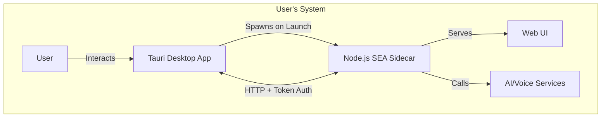

# Building TerminaI Binaries

> [!NOTE] This document defines the architecture, build process, and release
> strategy for packaging TerminaI as distributable installers for Linux and
> Windows.

---

## Table of Contents

1. [Architecture Overview](#1-architecture-overview)
2. [Build Pipeline](#2-build-pipeline)
3. [Phase 1: MVP Build](#3-phase-1-mvp-build)
4. [Phase 2: Production Polish](#4-phase-2-production-polish)
5. [Testing Strategy](#5-testing-strategy)
6. [CI/CD Workflow](#6-cicd-workflow)
7. [Implementation Roadmap](#7-implementation-roadmap)
8. [References](#8-references)

---

## 1. Architecture Overview

TerminaI uses a **Hybrid Sidecar Architecture**: a lightweight Rust/Tauri
desktop shell orchestrates a Node.js backend (packaged as a Single Executable
Application) that handles AI, voice, and terminal emulation.



### Component Summary

| Component       | Technology   | Purpose                                    |
| --------------- | ------------ | ------------------------------------------ |
| Desktop Shell   | Tauri (Rust) | Window management, native menus, lifecycle |
| Backend Sidecar | Node.js SEA  | AI agent, server, voice processing         |
| Frontend        | React + Vite | User interface (served by sidecar)         |

### Key Files

| File                                           | Purpose                              |
| ---------------------------------------------- | ------------------------------------ |
| `scripts/bundle_cli.js`                        | Bundles CLI + creates SEA binary     |
| `packages/desktop/scripts/bundle-web-ui.js`    | Copies frontend to sidecar resources |
| `packages/desktop/src-tauri/src/cli_bridge.rs` | Sidecar spawning and event handling  |
| `packages/desktop/src-tauri/tauri.conf.json`   | Tauri configuration                  |
| `sea-config.json`                              | Node SEA configuration               |

---

## 2. Build Pipeline

The build process transforms source code into platform-specific installers
through four stages:

```mermaid
graph LR
    subgraph "Stage 1: CLI Bundle"
        A[packages/cli] -->|esbuild| B[terminai_cli.mjs]
    end

    subgraph "Stage 2: SEA Creation"
        C[launcher.js] + B -->|Node SEA + Postject| D[terminai Binary]
    end

    subgraph "Stage 3: Frontend"
        E[packages/desktop/src] -->|Vite| F[dist/]
        F -->|Copy| G[resources/web-ui/]
    end

    subgraph "Stage 4: Packaging"
        H[Tauri App] + D + G -->|tauri build| I[Installers]
    end
```

### Binary Naming Convention

| Platform    | Binary Name                           |
| ----------- | ------------------------------------- |
| Linux x64   | `terminai-x86_64-unknown-linux-gnu`   |
| Windows x64 | `terminai-x86_64-pc-windows-msvc.exe` |
| macOS Intel | `terminai-x86_64-apple-darwin`        |
| macOS ARM   | `terminai-aarch64-apple-darwin`       |

---

## 3. Phase 1: MVP Build

**Goal:** Functional `.deb` (Linux) and `.msi` (Windows) installers that work on
clean systems.

### 3.1 Unified Build Script

Create `scripts/build-release.js` to orchestrate the entire pipeline:

```javascript
#!/usr/bin/env node
import { execSync } from 'child_process';
import { platform, arch } from 'os';

console.log(`🚀 Building TerminaI for ${platform()}-${arch()}`);

// Step 1: Build Frontend
execSync('npm run build', { cwd: 'packages/desktop', stdio: 'inherit' });

// Step 2: Bundle CLI Sidecar
execSync('node scripts/bundle_cli.js', { stdio: 'inherit' });

// Step 3: Copy Web UI to resources
execSync('node packages/desktop/scripts/bundle-web-ui.js', {
  stdio: 'inherit',
});

// Step 4: Build Tauri Installers
execSync('npm run tauri build', { cwd: 'packages/desktop', stdio: 'inherit' });

console.log('✅ Build complete!');
console.log('📦 Output: packages/desktop/src-tauri/target/release/bundle/');
```

### 3.2 Cross-Platform Build Script

Update `scripts/bundle_cli.js` to detect platform dynamically:

```javascript
import { platform, arch } from 'os';

function getTargetTriple() {
  const os = platform();
  const cpu = arch();

  if (os === 'linux' && cpu === 'x64') return 'x86_64-unknown-linux-gnu';
  if (os === 'win32' && cpu === 'x64') return 'x86_64-pc-windows-msvc';
  if (os === 'darwin' && cpu === 'x64') return 'x86_64-apple-darwin';
  if (os === 'darwin' && cpu === 'arm64') return 'aarch64-apple-darwin';

  throw new Error(`Unsupported platform: ${os}-${cpu}`);
}

const targetBin = `bin/terminai-${getTargetTriple()}${platform() === 'win32' ? '.exe' : ''}`;
```

### 3.3 Tauri Configuration

Update `tauri.conf.json` for production:

```json
{
  "productName": "TerminaI",
  "version": "0.21.0",
  "identifier": "ai.terminai.desktop",
  "bundle": {
    "active": true,
    "targets": ["deb", "appimage", "msi"],
    "icon": ["icons/32x32.png", "icons/128x128.png", "icons/icon.ico"],
    "shortDescription": "AI-powered terminal assistant",
    "longDescription": "TerminaI is an agentic AI assistant that runs in your terminal.",
    "resources": ["resources/**/*"],
    "externalBin": ["bin/terminai"]
  }
}
```

### 3.4 Native Dependencies

> [!IMPORTANT] The current `bundle_cli.js` externalizes `node-pty`, `sqlite3`,
> and `better-sqlite3`. However, TerminaI's `package.json` does NOT list these
> as direct dependencies. **Verify before bundling** by testing the SEA on a
> clean Docker container.

If native modules ARE required, bundle them alongside:

```
resources/
  ├── terminai_cli.mjs
  ├── node_modules/        # Native deps only
  │   └── [verified-deps]/
  └── web-ui/
```

Update `launcher.js` to load them:

```javascript
const resourceModules = path.join(execDir, 'resources', 'node_modules');
if (fs.existsSync(resourceModules)) {
  process.env.NODE_PATH = resourceModules;
  require('module').Module._initPaths();
}
```

### 3.5 Success Criteria

- [ ] `node scripts/build-release.js` completes on Linux
- [ ] Generated `.deb` installs on Ubuntu 22.04 (clean VM)
- [ ] App launches and sidecar connects
- [ ] `node scripts/build-release.js` completes on Windows
- [ ] Generated `.msi` installs on Windows 11 (clean VM)

---

## 4. Phase 2: Production Polish

**Goal:** Professional experience with branding, OS integration, and
auto-updates.

### 4.1 Desktop Integration

#### PATH Integration

**Linux (.deb):** Add `postinst` script:

```bash
#!/bin/bash
ln -sf /opt/terminai/bin/terminai-sidecar /usr/local/bin/terminai
```

**Windows (.msi):** Configure Tauri's NSIS to modify PATH registry.

#### Application Icons

Generate icon sets using `@tauri-apps/cli`:

```bash
npx tauri icon ./logo.png
```

Required formats:

- `.icns` (macOS): 16px–512px
- `.ico` (Windows): 16px–256px
- `.png` (Linux): 32px–512px

#### File Associations

```json
"bundle": {
  "fileAssociations": [{
    "ext": ["terminai"],
    "name": "TerminaI Project",
    "role": "Editor"
  }]
}
```

#### System Tray (Optional)

Add `tauri-plugin-tray` for:

- Show/Hide window toggle
- Voice mode quick access
- Quit

### 4.2 Code Signing

> [!WARNING] Without code signing, OS security dialogs appear during install.

| Platform | Solution                    | Cost       | Result                 |
| -------- | --------------------------- | ---------- | ---------------------- |
| Windows  | EV Code Signing Certificate | ~$400/year | No SmartScreen warning |
| macOS    | Apple Developer Program     | $99/year   | No Gatekeeper blocking |
| Linux    | N/A                         | Free       | Works without signing  |

**MVP Strategy:** Ship unsigned with clear installation documentation.

### 4.3 Auto-Updates

Configure Tauri's built-in updater:

```json
"plugins": {
  "updater": {
    "active": true,
    "endpoints": ["https://releases.terminai.ai/{{target}}/{{current_version}}"],
    "pubkey": "YOUR_ED25519_PUBLIC_KEY"
  }
}
```

**Update Flow:**

1. App checks endpoint on launch (max once per 24h)
2. Downloads new version + signature
3. Verifies signature against embedded pubkey
4. Installs and restarts

### 4.4 Voice Libraries

Bundle whisper.cpp or similar for offline STT:

```
resources/
  └── voice/
      ├── whisper-linux-x64
      ├── whisper-windows-x64.exe
      └── models/
          └── ggml-base.bin
```

### 4.5 Size Optimization

**Current estimate:** ~70MB

**Optimizations:**

```toml
# Cargo.toml
[profile.release]
strip = true
lto = true
codegen-units = 1
```

**Target:** <50MB

---

## 5. Testing Strategy

### Unit Tests

- `launcher.js` module resolution
- `cli_bridge.rs` health checking

### Integration Tests

- Sidecar lifecycle (spawn → connect → kill → cleanup)
- Token authentication flow

### E2E Installer Tests

| OS           | Installer | Environment         |
| ------------ | --------- | ------------------- |
| Ubuntu 22.04 | .deb      | Docker ubuntu:22.04 |
| Ubuntu 22.04 | .AppImage | Docker ubuntu:22.04 |
| Windows 11   | .msi      | GitHub Actions      |

**Test Script (Linux):**

```bash
sudo dpkg -i terminai_*.deb
terminai &
sleep 5
pgrep -f terminai && echo "✅ Running" || echo "❌ Failed"
killall terminai
```

---

## 6. CI/CD Workflow

**`.github/workflows/release.yml`**

```yaml
name: Release Build

on:
  push:
    tags: ['v*']

jobs:
  build-linux:
    runs-on: ubuntu-latest
    steps:
      - uses: actions/checkout@v4
      - uses: actions/setup-node@v4
        with: { node-version: 20 }
      - run: npm ci
      - run: node scripts/build-release.js
      - uses: actions/upload-artifact@v4
        with:
          name: linux-installers
          path: packages/desktop/src-tauri/target/release/bundle/*

  build-windows:
    runs-on: windows-latest
    steps:
      - uses: actions/checkout@v4
      - uses: actions/setup-node@v4
        with: { node-version: 20 }
      - run: npm ci
      - run: node scripts/build-release.js
      - uses: actions/upload-artifact@v4
        with:
          name: windows-installers
          path: packages/desktop/src-tauri/target/release/bundle/*
```

---

## 7. Implementation Roadmap

| Week | Focus               | Deliverables                              |
| ---- | ------------------- | ----------------------------------------- |
| 1    | MVP Foundation      | Cross-platform build script, basic test   |
| 2    | CI/CD + Integration | GitHub Actions workflow, PATH integration |
| 3    | Production Prep     | Auto-updater setup, E2E test suite        |
| 4    | Polish + Release    | Final QA, documentation, distribution     |

---

## 8. References

- [Node.js SEA Documentation](https://nodejs.org/api/single-executable-applications.html)
- [Tauri v2 Distribution Guide](https://v2.tauri.app/distribute/)
- [Postject (SEA Injector)](https://github.com/nodejs/postject)
- [Tauri Updater Plugin](https://v2.tauri.app/plugin/updater/)
