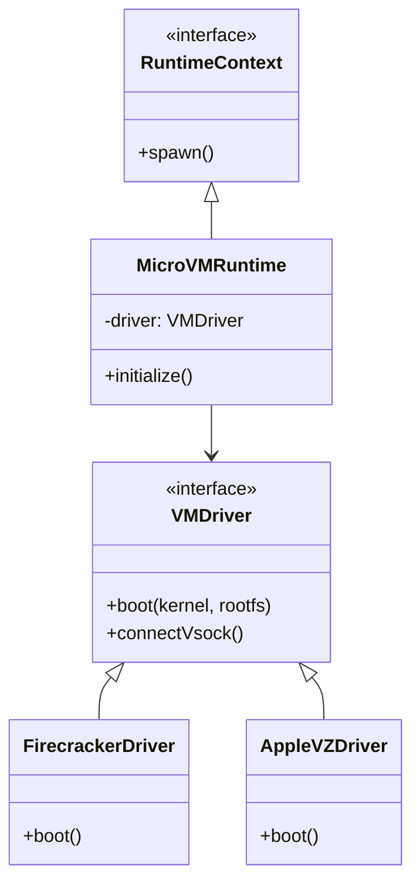

# ADR 001: Micro-VM Strategy (Phase 1.5)

> **Status**: Accepted **Date**: 2026-01-20 **Context**:
> `architecture-sovereign-runtime.md` (Section 6)

## Objective

Implement **Tier 1.5 isolation**: Micro-VMs. This provides strong security
boundaries (Kernel isolation) with near-native startup times (<100ms), bridging
the gap between insecure local execution and heavy container runtimes.

## Platform Analysis & Decisions

### 1. Linux (x86_64 / arm64)

**Decision**: Use **Firecracker** (via `child_process`).

- **Rationale**: Proven security (AWS Lambda), sub-125ms boot, low footprint
  (<5MB RAM overhead).
- **Alternative Considered**: Cloud Hypervisor (better device support but larger
  footprint).
- **Implementation**: Agent spawns `firecracker` process directly.

### 2. macOS (Apple Silicon)

**Decision**: Use **Virtualization.framework** via **`vfkit`**.

- **Rationale**: Firecracker does not support macOS. KVM is unavailable. `vfkit`
  provides a command-line interface compatible with our spawn model.
- **Implementation**: `vfkit --kernel ... --initrd ...`

### 3. Windows (x86_64)

**Decision**: **Defer native Micro-VMs**.

- **Rationale**: True Micro-VMs on Windows (HCS APIs) are high effort/low ROI
  for Phase 1.5. Existing Docker Desktop (WSL2) or Host Mode (Tier 2) covers
  this.
- **Strategy**: Continue using Tier 1 (Docker) or Tier 2 (Local) for Windows in
  Phase 1.5.

## Architecture

## Implementation Plan

### 1. Guest Kernel & RootFS

Unified kernel configuration for Linux and macOS guests (macOS guest is Linux).

- **Kernel**: Upstream Linux 6.x with minimal modules (virtio, vsock).
- **RootFS**: Alpine-based initramfs containing:
  - `init` (Node.js binary or agent stub)
  - `python3`
  - `terminai-apts`

### 2. Host-Guest Communication

**VSOCK** is the standard for high-performance host-guest IPC.

- **Host**: Agent connects to guest `vsock://<CID>:<PORT>`.
- **Guest**: Init process binds vsock listener.
- **Protocol**: JSON-RPC over raw socket.

### 3. Workspace Sharing

- **Initial Scope**: VSOCK-only (streaming stdin/stdout/file content).
- **Reason**: `virtio-fs` is complex on Firecracker/Linux; simpler to start with
  streaming.
- **Future**: Implement `virtio-fs` for performance.

## Risks & Mitigations

| Risk                                | Mitigation                                                    |
| :---------------------------------- | :------------------------------------------------------------ |
| **Arch Differences (x64 vs arm64)** | Build multi-arch kernel/rootfs bundles hosted on GHCR.        |
| **Kernel Boot Time**                | Strip kernel config to bare minimum (disable USB, GPU, etc.). |
| **Guest Agent Overhead**            | Use stripped Python or potentially static Node.js binary.     |
