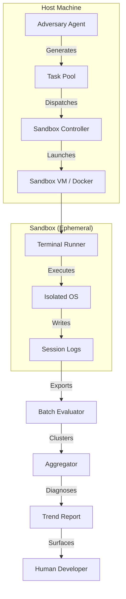

# TerminaI Evolution Lab

> **Internal Module**: Automated testing harness for continuous quality
> improvement.

---

## Overview

The Evolution Lab is a synthetic testing system that generates thousands of
diverse tasks, executes them in sandboxed environments (Docker by default), and
aggregates results to identify systemic weaknesses in TerminaI.

### Why This Exists

| Problem                                                     | Solution                              |
| ----------------------------------------------------------- | ------------------------------------- |
| Single developer can't manually test thousands of scenarios | Automated Adversary generates tasks   |
| Testing on real machine risks system damage                 | Ephemeral sandboxes isolate execution |
| Individual failures don't reveal patterns                   | Clustering surfaces root causes       |

---

## Architecture



---

## Components

### 1. Adversary Agent (`adversary.ts`)

Generates synthetic task prompts across all capability categories.

**Inputs**:

- TerminaI capability manifest (tools, agents)
- Past failure patterns (from previous runs)
- Category distribution weights

**Outputs**:

```json
{
  "taskId": "uuid",
  "category": "system_admin",
  "prompt": "Change the system timezone to America/Los_Angeles",
  "expectedOutcome": "system timezone is updated",
  "difficulty": "medium"
}
```

**Generation Strategy**:

- LLM with "Scenario Generation" system prompt
- Constrained by category quotas
- Avoids duplicate prompts

---

### 2. Sandbox Controller (`sandbox.ts`)

Manages ephemeral execution environments.

**Responsibilities**:

- Spin up Docker containers (KVM planned)
- Copy TerminaI CLI into sandbox
- Set up authentication (API keys via secrets manager)
- Extract logs after execution
- Tear down sandbox (stateless)

**Sandbox Types**:

| Type      | Use Case             | Implementation                       |
| --------- | -------------------- | ------------------------------------ |
| `docker`  | CLI-only tasks       | Docker + Node.js (default)           |
| `desktop` | GUI automation       | Docker image (Xvfb/desktop planned)  |
| `full-vm` | Network/Server tasks | Docker image today; KVM/QEMU planned |
| `host`    | Unsafe local runs    | Runs directly on host (opt-in only)  |

Host execution requires `--allow-unsafe-host`.

**Lifecycle**:

```
create() → prepare() → run() → extractLogs() → destroy()
```

**Default behavior**: `docker` uses Docker with
`terminai/evolution-sandbox:latest`. If Docker is unavailable, runs will fail
fast. Use `host` only when you explicitly want to run tasks on the local
machine. The `headless` sandbox type is a deprecated alias for `docker`.

---

### 3. Runner (`runner.ts`)

Executes TerminaI inside the sandbox.

**Execution Flow**:

1. Receive task from dispatcher
2. Enter sandbox (via Docker exec or SSH)
3. Run: `terminai -p "<prompt>" --non-interactive`
4. Capture stdout, stderr, exit code
5. Wait for log flush
6. Signal completion

**Concurrency**:

- Configurable parallelism (default: 4)
- Rate limiting to stay within LLM quota
- Timeout per task (default: 5 minutes)

---

### 4. Aggregator (`aggregator.ts`)

Clusters failures and identifies root causes.

**Pipeline**:

```
Session Logs → Score Each → Cluster by Error Type → Diagnose Clusters → Trend Report
```

**Clustering Dimensions**:

- Error type (timeout, tool failure, approval stuck)
- Component (PACLoop, shell, edit_file)
- Task category

**Output**:

```json
{
  "clusterId": "uuid",
  "errorType": "tool_timeout",
  "component": "shell",
  "affectedSessions": 47,
  "representativeLogs": ["session-123", "session-456"],
  "hypothesis": "Shell commands timeout before async operations complete",
  "suggestedFix": "Increase default shell timeout or add progress detection"
}
```

---

## Task Categories

| Category            | Coverage                     | Example Prompts                             |
| ------------------- | ---------------------------- | ------------------------------------------- |
| **System Admin**    | OS settings, packages        | "Install htop", "Change hostname to devbox" |
| **Networking**      | Remote servers, firewall     | "SSH to server X and check uptime"          |
| **GUI Automation**  | Desktop apps, browsers       | "Open Firefox, navigate to example.com"     |
| **Email/Messaging** | Communication tools          | "Send test email to test@example.com"       |
| **File Management** | Disk operations              | "Find files >100MB and list them"           |
| **Web Automation**  | Form filling, scraping       | "Submit login form on testsite.com"         |
| **Coding**          | Code generation, refactoring | "Write a Python script to parse CSV"        |

---

## Sandbox Strategy

### Phase 1: Docker (Default)

```yaml
# evolution-lab/Dockerfile
FROM node:20-bullseye RUN apt-get update && apt-get install -y git curl jq COPY
packages/cli /app/cli WORKDIR /app/cli RUN npm install CMD ["node",
"dist/index.js"]
```

### Phase 2: Docker (Desktop, Planned)

```yaml
FROM ubuntu:22.04 RUN apt-get update && apt-get install -y xvfb xfce4 firefox
chromium
# ... TerminaI install
```

### Phase 3: KVM VM (Full, Planned)

For scenarios requiring:

- Real network interfaces
- GPU access
- Persistent disk simulation

---

## Configuration

```json
{
  "evolutionLab": {
    "parallelism": 4,
    "tasksPerRun": 100,
    "taskTimeout": 300,
    "sandbox": {
      "type": "docker",
      "image": "terminai/evolution-sandbox:latest"
    },
    "quotaLimit": {
      "dailyTasks": 1000,
      "monthlyTasks": 20000
    },
    "categories": {
      "system_admin": 0.2,
      "networking": 0.1,
      "gui_automation": 0.15,
      "email": 0.05,
      "file_management": 0.15,
      "web_automation": 0.15,
      "coding": 0.2
    }
  }
}
```

---

## CLI Interface

```bash
# Run the default lab flow (build + run) with Docker sandbox
npm run evolution

# Generate 100 tasks
evolution-lab adversary --count 100 --output tasks.json

# Run tasks in sandbox
evolution-lab run --tasks tasks.json --sandbox-type docker

# Aggregate results
evolution-lab aggregate --logs ~/.terminai/logs --output report.md
```

---

## Data Flow

```
┌─────────────┐     ┌─────────────┐     ┌─────────────┐
│  Adversary  │────▶│   Runner    │────▶│ Aggregator  │
│  (Generate) │     │  (Execute)  │     │  (Analyze)  │
└─────────────┘     └─────────────┘     └─────────────┘
      │                   │                   │
      ▼                   ▼                   ▼
  tasks.json         session.jsonl       report.md
```

---

## Security Considerations

| Risk             | Mitigation                                              |
| ---------------- | ------------------------------------------------------- |
| API key exposure | Secrets injected at runtime, never persisted in sandbox |
| Sandbox escape   | Docker rootless mode, AppArmor profiles                 |
| Network abuse    | Outbound traffic restricted to allowlist                |
| Disk exhaustion  | Per-sandbox disk quotas                                 |

---

## Verification Plan

1. **Unit Tests**: Each component tested in isolation
2. **Mini-Evolution**: Run 10 tasks end-to-end, verify logs captured
3. **Cross-Category**: Ensure each category produces valid tasks
4. **Trend Report**: Verify clustering identifies a synthetic "bug"

---

## Files

| File                                       | Purpose                 |
| ------------------------------------------ | ----------------------- |
| `packages/evolution-lab/src/adversary.ts`  | Task generation         |
| `packages/evolution-lab/src/sandbox.ts`    | Environment management  |
| `packages/evolution-lab/src/runner.ts`     | Execution orchestration |
| `packages/evolution-lab/src/aggregator.ts` | Failure clustering      |
| `packages/evolution-lab/Dockerfile`        | Sandbox image           |
