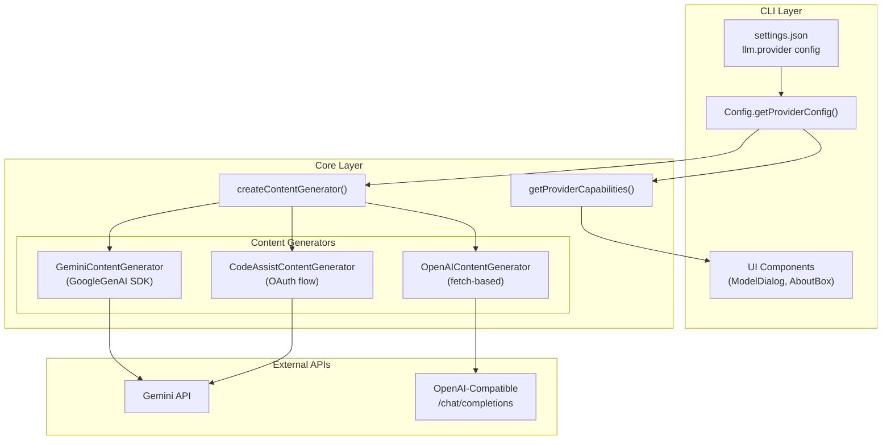

# Multi-LLM Provider Support Architecture

> **Status**: Implemented  
> **Version**: 0.21.0  
> **Last Updated**: 2025-12-26

## Overview

TerminaI supports multiple LLM providers through a pluggable architecture that
allows users to choose between Gemini (default), OpenAI-compatible APIs, and
future providers like Anthropic.

## Architecture Diagram



## Provider Configuration

### Settings Schema (`settings.json`)

```json
{
  "llm": {
    "provider": "gemini",
    "openaiCompatible": {
      "baseUrl": "https://api.openai.com/v1",
      "model": "gpt-4o",
      "auth": {
        "type": "bearer",
        "envVarName": "OPENAI_API_KEY"
      },
      "headers": {
        "X-Custom-Header": "value"
      }
    }
  }
}
```

### Provider Types (`providerTypes.ts`)

```typescript
enum LlmProviderId {
  GEMINI = 'gemini',
  OPENAI_COMPATIBLE = 'openai_compatible',
  ANTHROPIC = 'anthropic',
}

interface ProviderConfig {
  provider: LlmProviderId;
}

interface OpenAICompatibleConfig extends ProviderConfig {
  provider: LlmProviderId.OPENAI_COMPATIBLE;
  baseUrl: string;
  model: string;
  auth?: {
    type: 'bearer' | 'api-key' | 'none';
    apiKey?: string;
  };
  extraHeaders?: Record<string, string>;
}

interface ProviderCapabilities {
  supportsCitations: boolean;
  supportsImages: boolean;
  supportsTools: boolean;
  supportsStreaming: boolean;
}
```

## Provider Selection Flow


## Key Components

### 1. OpenAIContentGenerator

Location: `packages/core/src/core/openaiContentGenerator.ts`

Handles OpenAI-compatible API interactions:

| Method                    | Description                                           |
| ------------------------- | ----------------------------------------------------- |
| `generateContent()`       | Non-streaming text/tool generation                    |
| `generateContentStream()` | SSE streaming with tool call accumulation             |
| `countTokens()`           | Local token estimation via `estimateTokenCountSync()` |
| `convertTools()`          | Gemini Tool → OpenAI function schema                  |
| `convertSchemaToOpenAI()` | `Type.OBJECT` → `"object"` mapping                    |

**Key Features:**

- Auth modes: `bearer`, `api-key`, `none`
- Proxy support via `ProxyAgent`
- Multi-chunk tool call accumulation
- Debug-mode-only error logging

### 2. Provider Capability Gating

Location: `packages/core/src/core/providerCapabilities.ts`

```typescript
function getProviderCapabilities(provider: LlmProviderId): ProviderCapabilities {
  switch (provider) {
    case LlmProviderId.GEMINI:
      return { supportsCitations: true, supportsImages: true, ... };
    case LlmProviderId.OPENAI_COMPATIBLE:
      return { supportsCitations: false, supportsImages: false, ... };
  }
}
```

Used in UI to conditionally render:

- Citations display (only if `supportsCitations`)
- Preview model marketing (only for Gemini)
- Image upload controls (only if `supportsImages`)

### 3. Schema Conversion

Gemini uses `Type` enum values (`OBJECT`, `STRING`), while OpenAI requires
lowercase JSON Schema types.

```typescript
// Gemini Schema
{ type: Type.OBJECT, properties: { location: { type: Type.STRING } } }

// Converted to OpenAI
{ type: "object", properties: { location: { type: "string" } } }
```

Recursive conversion handles nested `properties`, `items`, `required`, `enum`,
and `nullable`.

## Request/Response Translation

### Gemini → OpenAI Request

| Gemini                     | OpenAI                         |
| -------------------------- | ------------------------------ |
| `contents[].role: "model"` | `messages[].role: "assistant"` |
| `contents[].role: "user"`  | `messages[].role: "user"`      |
| `config.systemInstruction` | `messages[0].role: "system"`   |
| `config.tools`             | `tools[].function`             |

### OpenAI → Gemini Response

| OpenAI                         | Gemini                                      |
| ------------------------------ | ------------------------------------------- |
| `choices[].message.content`    | `candidates[].content.parts[].text`         |
| `choices[].message.tool_calls` | `candidates[].content.parts[].functionCall` |
| `finish_reason: "stop"`        | `finishReason: "STOP"`                      |

## Streaming Architecture


**Tool Call Accumulation:**

- Tool calls arrive in chunks (name/args split across SSE events)
- `pendingToolCalls` buffer accumulates until `finish_reason`
- Final yield includes assembled `functionCall` parts

## Environment Variables

| Variable            | Purpose                                     |
| ------------------- | ------------------------------------------- |
| `TERMINAI_BASE_URL` | Override Gemini API base URL (validated)    |
| `OPENAI_API_KEY`    | Default key for OpenAI-compatible providers |
| `TERMINAI_API_KEY`  | Gemini API key                              |

Legacy compatibility: Gemini-prefixed environment variables (including
`GEMINI_BASE_URL`) are aliased to Terminai-prefixed equivalents.

## Testing Strategy

### Unit Tests

| Test File                        | Coverage                                               |
| -------------------------------- | ------------------------------------------------------ |
| `openaiContentGenerator.test.ts` | 15 tests covering generation, streaming, tools, errors |
| `contentGenerator.test.ts`       | 21 tests including provider selection, OAuth bypass    |

### Key Test Cases

1. **OAuth Base URL**: `LOGIN_WITH_GOOGLE` ignores `TERMINAI_BASE_URL`
2. **Schema Conversion**: Gemini `Type` → JSON Schema lowercase
3. **Streaming Edge Cases**: Malformed chunks, abort signal, finish-only
4. **Capability Gating**: Provider determines UI features

## Future Extensibility

Adding a new provider (e.g., Anthropic):

1. Add to `LlmProviderId` enum
2. Create `AnthropicContentGenerator` implementing `ContentGenerator`
3. Add case to `createContentGenerator()` factory
4. Define capabilities in `getProviderCapabilities()`
5. Add settings schema for provider-specific config

## Security Considerations

- API keys resolved from environment at runtime (not stored in settings)
- `baseUrlHost` shown in About box (no full URL or credentials)
- Debug logging gated behind `getDebugMode()`
- Unsupported modalities throw clear errors (no silent failures)
