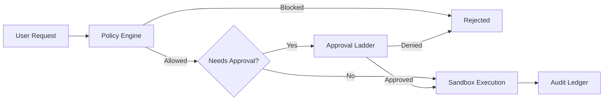

# Sandbox Governance Integration

> **Key Principle**: Sandboxing is a _defense-in-depth mechanism_, NOT a policy
> bypass path.

---

## Overview

The [Sovereign Sandbox Architecture](./terminai-sandbox-architecture.md)
provides isolation for tool execution, but it does **not** replace or bypass
TerminAI's governance controls.

---

## How Sandbox Relates to Approvals

The sandbox provides **isolation**, not **authorization**:

| Layer           | Responsibility                          | Sandbox Role      |
| --------------- | --------------------------------------- | ----------------- |
| Policy Engine   | Decides IF an action is allowed         | No role           |
| Approval Ladder | Gets human approval for risky actions   | No role           |
| Sandbox         | Provides isolation for APPROVED actions | **Executes here** |
| Audit Ledger    | Records all actions for compliance      | Logs execution    |

---

## Data Flow



The sandbox is **downstream** of policy decisions. An action rejected by policy
is NEVER executed in the sandbox.

---

## Common Misconceptions

| ❌ Wrong                               | ✓ Correct                                |
| -------------------------------------- | ---------------------------------------- |
| "Sandbox mode means no approvals"      | Approvals still required based on risk   |
| "Sandbox = safe to run anything"       | Sandbox limits BLAST RADIUS, not INTENT  |
| "Sandbox bypasses the approval ladder" | Sandbox only runs AFTER approval granted |
| "I can disable safety with sandbox"    | Safety invariants apply inside sandbox   |

---

## Sandbox + Three-Axis Safety Model

The [Safety Architecture](./safety-architecture.md) uses three axes:

1. **Outcome** (Reversibility)
2. **Intention** (Provenance)
3. **Domain** (Trust)

**Sandboxing affects the Outcome axis:**

- Actions inside the sandbox are more reversible (container can be reset)
- This may reduce the risk level for some operations
- But irreversible system actions (network, external APIs) are still dangerous

**Sandboxing does NOT change:**

- Intention classification (explicit vs autonomous)
- Domain classification (workspace vs system vs external)
- Safety invariants (unbounded deletes still require PIN)

---

## Audit Trail

All sandbox executions are logged to the audit ledger:

```json
{
  "timestamp": "2026-01-20T05:15:00Z",
  "action": "shell.execute",
  "command": "python3 -c 'from terminai_apts.action import cleanup_downloads; ...'",
  "sandbox": true,
  "sandboxImage": "ghcr.io/prof-harita/terminai/sandbox:0.53.0",
  "approval": {
    "level": "B",
    "granted": true,
    "grantedAt": "2026-01-20T05:14:58Z"
  }
}
```

---

## Configuration

Sandboxing is controlled independently from safety profiles:

```json
{
  "tools": {
    "sandbox": true
  },
  "security_profile": "balanced"
}
```

- `tools.sandbox` controls whether sandboxing is used
- `security_profile` controls approval requirements
- They are orthogonal — both can be on, off, or mixed

---

## Summary

| Governance Control | Sandbox Impact                   |
| ------------------ | -------------------------------- |
| Policy Engine      | None                             |
| Approval Ladder    | None                             |
| Safety Invariants  | None                             |
| Risk Calculation   | Slight (reversibility)           |
| Audit Logging      | Enhanced (sandbox context added) |

**Bottom line:** Sandbox provides container-level isolation for approved
actions. It is not a way to bypass governance.

---

## Related Documents

- [Sovereign Sandbox Architecture](./terminai-sandbox-architecture.md)
- [Safety Architecture](./safety-architecture.md)
- [Fork Zones](./FORK_ZONES.md) — sandbox is CANON zone
