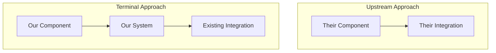

# Upstream Merge Plan: Week of {DATE}

> **Generated by:** {AGENT_NAME}  
> **Status:** PENDING_LOCAL_REVIEW  
> **Upstream Range:** {LAST_SYNCED_HASH}..{CURRENT_UPSTREAM_HEAD}  
> **Total Commits:** {N} (🟢{LEVERAGE} 🔴{CANON} 🟡{QUARANTINE} ⚪{SKIP})

---

## Executive Summary

**What changed upstream:**  
{Comprehensive description of the upstream changes. Be thorough.}

**Recommended approach:**  
{Detailed recommendation with rationale}

**Key risks:**  
{List of significant risks with mitigations}

**Estimated effort:**  
{Realistic estimate based on complexity}

---

## Section 1: Commit Classification

### 🟢 LEVERAGE (Cherry-pick directly)

| Hash   | Title   | Files Changed | Risk Level      | Notes                |
| ------ | ------- | ------------- | --------------- | -------------------- |
| {hash} | {title} | {file list}   | Low/Medium/High | {verification notes} |

**Verification performed:**

```bash
# Confirm no overlap with CANON systems
grep -r "term" packages/core/src/
# No matches found
```

---

### 🔴 CANON (Reimplement intent)

| Hash   | Title   | Overlaps With | Upstream Intent        | Our Approach         |
| ------ | ------- | ------------- | ---------------------- | -------------------- |
| {hash} | {title} | {our file}    | {what upstream solves} | {how we'll solve it} |

**Verification performed:**

```bash
# Confirm overlap exists
grep -r "term" packages/core/src/path/to/file.ts
# Match found at line X
```

---

### 🟡 QUARANTINE (Needs human decision)

| Hash   | Title   | New Subsystem? | Potential Overlap | Recommendation      | Rationale            |
| ------ | ------- | -------------- | ----------------- | ------------------- | -------------------- |
| {hash} | {title} | Yes/No         | {if any}          | LEVERAGE/CANON/SKIP | {detailed reasoning} |

**Why quarantined:** {Detailed explanation of uncertainty}

---

### ⚪ SKIP (Ignore)

| Hash   | Title   | Reason                                       |
| ------ | ------- | -------------------------------------------- |
| {hash} | {title} | Google telemetry / Version bump / Irrelevant |

---

## Section 2: Architecture Specifications

_For each 🔴 CANON commit, provide full architecture spec_

---

### Architecture: {Commit Title}

> **Upstream Commit:** {hash}  
> **Upstream Files:** {list of files changed}

#### 2.1 Upstream Intent Analysis

**Problem upstream is solving:** {Detailed analysis of what the upstream change
accomplishes}

**Their approach:** {How upstream implemented it}

**Why we can't merge directly:** {Specific conflicts with our CANON systems}

#### 2.2 Our System Context



**Current state of our system:** {Description of relevant TerminaI architecture}

**How this change fits:** {Integration points and considerations}

#### 2.3 Technical Specification

##### Component: {Name}

**Purpose:** {What problem does this solve}

**Interface:**

```typescript
// Exact function signatures, types, or API contracts
export interface NewFeature {
  // Field-level documentation
  enabled: boolean;
  options: FeatureOptions;
}

export function applyFeature(config: NewFeature): Result;
```

**Behavior:**

_Happy path:_ {Step by step description}

_Edge cases:_

- {Edge case 1}: {Handling}
- {Edge case 2}: {Handling}

_Error conditions:_

- {Error 1}: {How to handle}
- {Error 2}: {How to handle}

**Files affected:**

- `packages/core/src/path/to/file.ts` — {What changes}
- `packages/core/src/path/to/other.ts` — {What changes}

#### 2.4 Data Models

```typescript
// All types, interfaces, schemas needed
// Include comprehensive field-level documentation

/**
 * Represents {description}
 */
interface FeatureConfig {
  /** Whether the feature is enabled */
  enabled: boolean;

  /** Configuration options */
  options: {
    /** First option description */
    optionA: string;
    /** Second option description */
    optionB: number;
  };
}
```

#### 2.5 Security Considerations

**Trust boundaries:** {Does this touch trust boundaries? How?}

**Approval Ladder integration:** {Required approval level: A/B/C. Rationale.}

**Sensitive data handling:** {Any credentials, tokens, or PII considerations}

**Audit implications:** {What should be logged for audit trail}

#### 2.6 Testing Strategy

**Unit tests:**

- `packages/core/src/path/to/file.test.ts` — {What to test}
- Test cases: {List key test scenarios}

**Integration tests:**

- {Integration test file and scope}

**Manual verification:**

1. {Step 1}
2. {Step 2}
3. {Expected result}

---

## Section 3: Atomic Task List

_Each task is self-contained, 5-30 minutes, with complete context_

---

### Implementation Checklist

#### Phase 1: Foundation (Types & Interfaces)

- [ ] Task 1.1: {Description}
- [ ] Task 1.2: {Description}

#### Phase 2: Core Logic

- [ ] Task 2.1: {Description}
- [ ] Task 2.2: {Description}

#### Phase 3: Integration

- [ ] Task 3.1: {Description}
- [ ] Task 3.2: {Description}

#### Phase 4: Testing

- [ ] Task 4.1: {Description}
- [ ] Task 4.2: {Description}

#### Phase 5: Cherry-Picks

- [ ] Task 5.1: Cherry-pick LEVERAGE commits
- [ ] Task 5.2: Resolve any conflicts

#### Phase 6: Final Verification

- [ ] Task 6.1: Run preflight
- [ ] Task 6.2: Update absorption-log.md
- [ ] Task 6.3: Open PR

---

### Task Details

#### Task 1.1: {Title}

**Objective:** {One sentence on what this accomplishes}

**Prerequisites:** {Which tasks must be done first, or "None"}

**Files to modify:**

- `packages/core/src/path/to/file.ts` — {What changes}

**Detailed steps:**

1. {Specific action}

   ```typescript
   // Code to add/modify
   ```

2. {Next action}

   ```typescript
   // Code to add/modify
   ```

3. {Continue as needed}

**Definition of done:**

- [ ] {Specific verifiable outcome}
- [ ] Test command: `npm test -- path/to/file.test.ts`
- [ ] TypeScript check: `npm run typecheck`

**Potential issues:**

- {What could go wrong}: {How to handle it}

---

_(Repeat Task Details for all tasks)_

---

## Section 4: Red-Team Review

_Completed by Red-Team Agent_

---

### Classification Challenges

**LEVERAGE commits verified:**

- [ ] {hash}: No overlap with CANON systems (verified via grep)
- [ ] {hash}: Import chain clean

**CANON commits verified:**

- [ ] {hash}: Overlap confirmed, intent correctly captured
- [ ] {hash}: Architecture matches current codebase

**SKIP commits verified:**

- [ ] No missed security fixes

### Architecture Attacks

- [ ] No Approval Ladder bypass in proposed implementation
- [ ] Type signatures compatible with existing code
- [ ] Testing strategy covers edge cases

### Task List Attacks

- [ ] Prerequisites correctly ordered (no circular dependencies)
- [ ] Code snippets syntactically valid
- [ ] All file paths verified to exist (or marked [NEW])
- [ ] "Definition of done" checks are actually verifiable

### Missed Risks

**Identified risks not in drafter's plan:** {List any additional risks found}

**Worst case if executed blindly:** {Assessment of maximum damage}

### Red-Team Amendments

| Location  | Issue     | Fix Applied  |
| --------- | --------- | ------------ |
| {section} | {problem} | {correction} |

### Red-Team Verdict

- [ ] **PASS** — Plan is solid, ready for local review
- [ ] **PASS WITH AMENDMENTS** — Issues found and fixed (see above)
- [ ] **REVISE** — Significant issues require drafter revision
- [ ] **REJECT** — Fundamental problems, restart required

**Signed:** {RED_TEAM_AGENT_NAME}  
**Date:** {TIMESTAMP}

---

## Section 5: Local Agent Review

_Completed by Local Agent before execution_

---

### Pre-Execution Verification

**Documentation check:**

- [ ] Both drafter and red-team sections complete
- [ ] Red-team verdict is PASS or PASS WITH AMENDMENTS
- [ ] No unresolved QUARANTINE items (or human decision recorded)

**Architecture review:**

- [ ] System diagrams accurate to current codebase
- [ ] Interfaces match existing patterns
- [ ] Security considerations complete
- [ ] No Approval Ladder bypass

**Task list review:**

- [ ] Tasks are appropriately scoped
- [ ] Prerequisites correctly ordered
- [ ] Code snippets are correct and complete
- [ ] All files exist or are clearly marked [NEW]
- [ ] Verification commands are correct

### Execution Readiness

- [ ] All QUARANTINE decisions resolved
- [ ] Preflight expected to pass
- [ ] No open questions blocking execution
- [ ] Rollback plan understood

### Final Decision

- [ ] **EXECUTE** — Proceed with plan as written
- [ ] **EXECUTE WITH AMENDMENTS** — Proceed with noted changes
- [ ] **RETURN TO DRAFTER** — Issues require rework
- [ ] **ESCALATE TO HUMAN** — Beyond agent authority

**Signed:** {LOCAL_AGENT_NAME}  
**Date:** {TIMESTAMP}

---

## Appendix: Rollback Plan

If merged code causes issues:

```bash
# Identify the merge commit
git log --oneline -10

# Revert the merge
git revert -m 1 {MERGE_COMMIT_HASH}

# Push revert
git push origin main
```

**Files at risk:** {List of files that would need attention on rollback}

---

## Appendix: Absorption Log Entry

_Add this to `.upstream/absorption-log.md` after successful merge_

```markdown
### Week of {DATE}

| Date   | Upstream Range | PR           | Classification          | Status |
| ------ | -------------- | ------------ | ----------------------- | ------ |
| {DATE} | {START}..{END} | #{PR_NUMBER} | 🟢{N} 🔴{N} 🟡{N} ⚪{N} | ✅     |

**Summary:** {Brief description of what was merged}

**Notable changes:**

- {Key change 1}
- {Key change 2}
```
