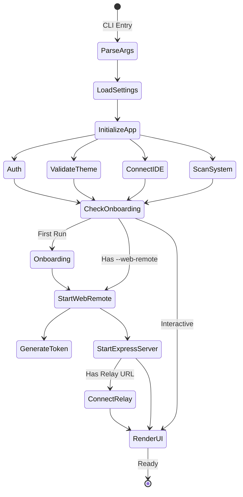
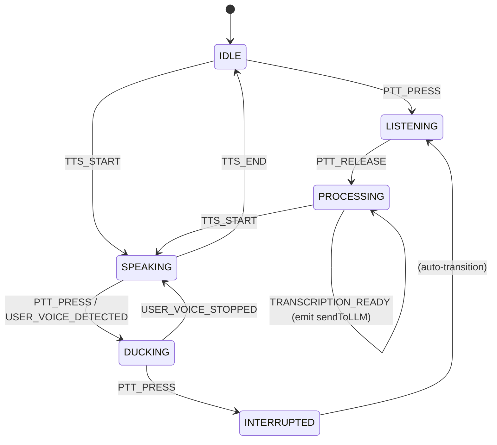
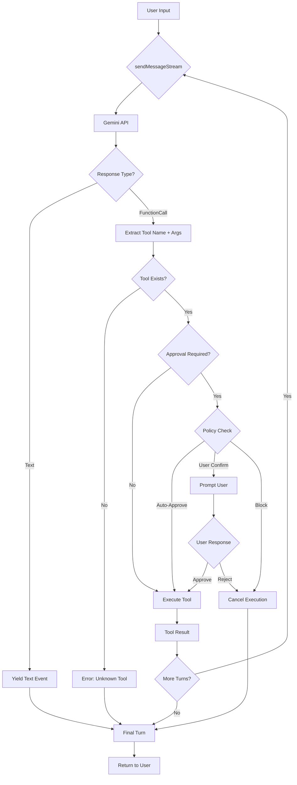
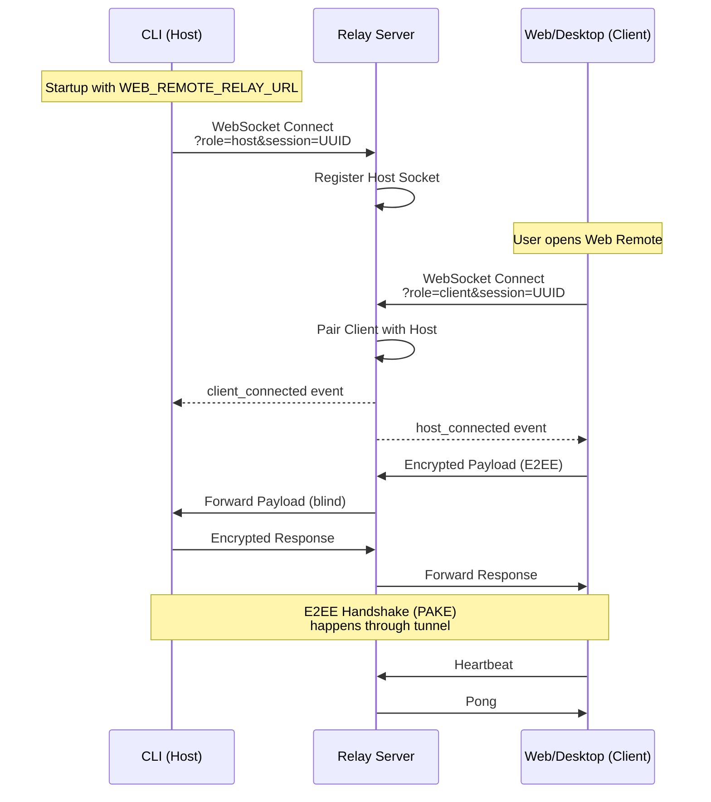
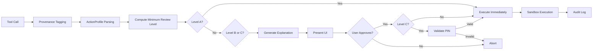
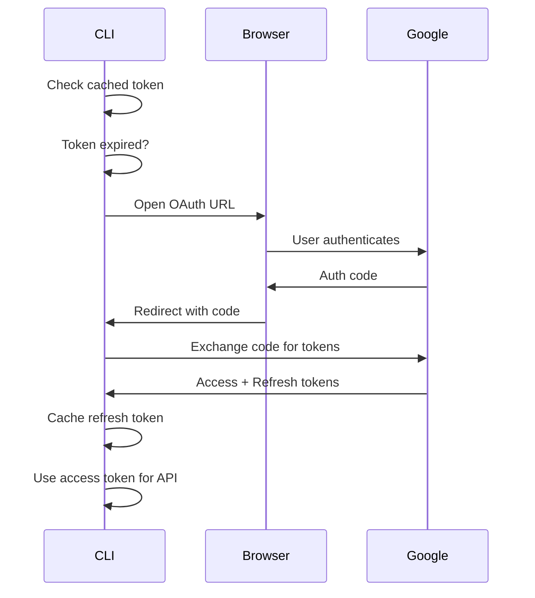

# TerminaI User Journey & Logical Architecture

## 1. Introduction

This document maps the logical architecture, state machines, and data flows of
TerminaI across its three main modalities:

1.  **CLI (Command Line Interface):** The core agent runtime and "Host".
2.  **Nouri App (Desktop):** A Tauri-based GUI wrapper and "Client".
3.  **Cloud Relay:** A Zero-Trust E2EE tunneling service.

---

## 2. Core Logical Architecture

### 2.1. The "Brain" (GeminiClient)

- **Location:**
  [`packages/core/src/core/client.ts`](file:///home/profharita/Code/terminaI/packages/core/src/core/client.ts)
- **Role:** Manages the LLM interaction loop.
- **Key Components:**
  - **Context Management:** Maintains chat history (`HistoryItem[]`) and injects
    IDE context.
  - **Tool Execution:** Detects `functionCall` parts, executes tools via
    `ToolRegistry`.
  - **Loop Detection:** Uses `LoopDetectionService` to prevent recursive loops.
  - **Streaming:** `sendMessageStream` yields real-time events.

### 2.2. Configuration & Settings

- **Loader:**
  [`packages/cli/src/config/settings.ts`](file:///home/profharita/Code/terminaI/packages/cli/src/config/settings.ts)
- **State:**
  [`packages/core/src/config/config.ts`](file:///home/profharita/Code/terminaI/packages/core/src/config/config.ts)
- **Hierarchy:** System Defaults → User → Workspace → System Overrides
- **Merge Strategy:** Recursive deep merge with path-aware rules.

---

## 3. State Machines & Flows

### 3.1. Startup & Initialization Flow



**Key Decision Points:**

- **First Run:** Check `~/.gemini/firstRun` → Trigger onboarding
- **Web Remote:** `--web-remote` flag → Start Express server on loopback/0.0.0.0
- **Relay:** `WEB_REMOTE_RELAY_URL` env → Connect as host to relay

---

### 3.2. Voice Mode State Machine



**Events:**

- `PTT_PRESS/RELEASE`: Push-to-Talk button
- `TRANSCRIPTION_READY`: STT output ready
- `TTS_START/END`: Text-to-Speech lifecycle
- `USER_VOICE_DETECTED/STOPPED`: Voice Activity Detection (VAD)

**Emissions:**

- `startRecording`, `stopRecording`
- `transcribe`, `sendToLLM`, `speak`
- `duckAudio`, `restoreAudio`, `stopTTS`

---

### 3.3. Tool Execution Decision Tree



**Approval Modes:**

- `YOLO`: Auto-approve all
- `CAUTIOUS`: Prompt for risky tools
- `STRICT`: Prompt for all tools

---

### 3.4. Cloud Relay Connection Flow



**Security Model:**

- **E2EE:** Relay server cannot decrypt payloads
- **Rate Limiting:** Per-IP and per-session throttling
- **Heartbeat:** 30s interval, disconnect on timeout

---

## 4. Modality: CLI (The Agent Host)

### 4.1. A2A Server Architecture

The CLI runs an Express server exposing the agent over HTTP.

**Key Routes:**

- `POST /executeCommand`: Run agent commands (non-streaming)
- `POST /message/stream`: A2A JSON-RPC streaming endpoint
- `GET /ui`: Serves Web Client static assets
- `GET /healthz`, `/whoami`: Health and metadata

**Flow:**

1. Desktop/Web Client → HTTP POST to CLI
2. CLI validates auth (HMAC signature)
3. CLI routes to `CoderAgentExecutor`
4. Executor creates task → streams SSE events

---

## 5. Modality: Nouri App (Desktop)

### 5.1. Communication Bridge

[`packages/desktop/src/hooks/useCliProcess.ts`](file:///home/profharita/Code/terminaI/packages/desktop/src/hooks/useCliProcess.ts)

**Request Flow:**

```typescript
sendMessage(text) → postToAgent(baseUrl, token, {
  jsonrpc: "2.0",
  method: "message/stream",
  params: { message: { parts: [{ text }] } }
}) → readSseStream() → handleJsonRpc()
```

**Security:**

- HMAC-SHA256 signature on body
- Nonce header prevents replay
- Token stored in settings/env

---

## 6. Cross-Modality Summary

| Component       | Role          | Protocol           | Security     |
| --------------- | ------------- | ------------------ | ------------ |
| **CLI**         | Agent Host    | Express HTTP/SSE   | Token Auth   |
| **Desktop**     | Client UI     | JSON-RPC over HTTP | HMAC Signing |
| **Cloud Relay** | Tunnel Broker | WebSocket          | E2EE (PAKE)  |

---

## 7. Computational Possibilities & Capabilities

### 7.1. Core Capabilities (The "Brain")

- **Recursive Problem Solving:** Can detect loops and self-correct (via
  `LoopDetectionService`).
- **Multi-Modal Input:** Processes text, images, and audio (via Voice Mode).
- **Tool Chaining:** Can execute sequences of tools (e.g., `LS` -> `READ` ->
  `EDIT`) without user interruption in `YOLO` mode.
- **Context Awareness:** Automatically injects IDE state (open files, cursor
  position) into the prompt context.

### 7.2. CLI Capabilities (The "Host")

- **Universal Runtime:** Runs on any Node.js supported OS (Linux, macOS,
  Windows).
- **Voice Interface:** Half-duplex voice interaction with VAD and
  interruptibility ("Ducking").
- **Remote Hosting:** Can serve the agent logic to any authorized remote client
  via Cloud Relay.
- **System Control:** Full access to the host's shell and filesystem (sandboxing
  optional).

### 7.3. Desktop Capabilities (The "Client")

- **Rich UI Interaction:** Visual rendering of tool outputs (tables, markdown).
- **System Integration:** Native notifications and global hotkeys.
- **Terminal Emulation:** Embedded xterm.js terminal for direct shell
  interaction alongside agent chat.
- **Secure Bridging:** Acts as a secure frontend for the local CLI agent.

---

## 8. Safety Architecture: The A/B/C Approval Ladder

> **Critical Invariant**: Explicit user confirmation is ALWAYS required before
> destructive/irreversible actions.

### 8.1. Review Levels

TerminaI enforces **deterministic minimum review levels** based on action
profiles:

| Level | Name              | Requires                   | Applies To                      | Example                                     |
| ----- | ----------------- | -------------------------- | ------------------------------- | ------------------------------------------- |
| **A** | Auto-approve      | None                       | Read-only, bounded, reversible  | `git add`, `ls`, `cat file.txt`             |
| **B** | User confirmation | Click to approve           | Risky or unbounded operations   | `npm install`, `git push`, file write       |
| **C** | PIN protected     | Confirmation + 6-digit PIN | Extreme/irreversible operations | `rm -rf`, `git reset --hard`, sudo commands |

### 8.2. Safety Pipeline (End-to-End)


```

**Key Implementation Details**:
- **Brain Authority**: The model can INCREASE caution (escalate A→B or B→C) but NEVER reduce the minimum review level
- **Provenance Tracking**: Actions tagged with origin (local user vs web-remote vs file vs tool output)
- **Context Bumps**: Operations outside workspace boundaries automatically escalate review level
- **Audit Trail**: All actions logged with profile + approval outcome for debugging

### 8.3. Approval Modes

TerminaI supports three operational modes configurable via `security.approvalMode`:

| Mode | Behavior | Use Case | Safety Impact |
|------|----------|----------|---------------|
| `"safe"` | Default: Level A auto-runs, B/C require explicit approval | Normal usage | Maximum safety |
| `"prompt"` | Ask for confirmation on ALL tools (even Level A) | Paranoid/learning mode | Extreme caution |
| `"yolo"` | Auto-approve ALL actions (⚠️ dangerous) | Demos, trusted scripts | ⚠️ **Disabled in Voice Mode** |

**Critical Safety Gates**:
- Voice mode **ALWAYS disables YOLO** (safety invariant)
- Settings can enforce `security.disableYoloMode: true` to prevent CLI flag override
- Level C actions ALWAYS require PIN, regardless of approval mode

---

## 9. Authentication Flows

### 9.1. Supported Auth Types

TerminaI supports multiple auth providers, stored in `~/.terminai/settings.json` under `security.auth.selectedType`:

| Auth Type | Trigger | Token Storage | Use Case |
|-----------|---------|---------------|----------|
| `LOGIN_WITH_GOOGLE` | OAuth flow in browser | Cached refresh token | Personal accounts |
| `API_KEY` | `TERMINAI_API_KEY` env var | Environment variable | CI/CD, headless servers |
| `COMPUTE_ADC` | Google Cloud VM metadata | ADC chain | Cloud Shell, GCE instances |

### 9.2. OAuth Flow (LOGIN_WITH_GOOGLE)



**Key Files**:
- Token cache: `~/.config/gcloud/application_default_credentials.json` or `~/.terminai/auth/{authType}.json`  
- OAuth client: [`packages/core/src/core/auth/oauth.ts`](file:///home/profharita/Code/terminaI/packages/core/src/core/auth/oauth.ts)

### 9.3. Re-Authentication Triggers

- **Token expiration**: Refresh token automatically (silent)
- **Scope change**: User must re-authenticate
- **Enforced auth type mismatch**: `security.auth.enforcedType !== selectedType`
- **First run**: No cached credentials exist

---

## 10. Settings Deep Dive

### 10.1. Settings Hierarchy

TerminaI loads settings from multiple sources, merged in this order:

1. **System Defaults** (hardcoded in schema)
2. **User Settings** (`~/.terminai/settings.json`)
3. **Workspace Settings** (`.terminai/settings.json` in project root)
4. **System Overrides** (enforced by admin, cannot be user-overridden)

**Merge Strategy**: Recursive deep merge. Arrays are replaced (not concatenated). Workspace overrides user, user overrides defaults.

### 10.2. Critical Settings Reference

#### Security Settings

```json
{
  "security": {
    "approvalPin": "123456",           // 6-digit PIN for Level C actions
    "approvalMode": "safe",              // "safe" | "prompt" | "yolo"
    "disableYoloMode": false,            // Permanently disable YOLO
    "enablePermanentToolApproval": false,// Show "Allow forever" checkbox
    "auth": {
      "selectedType": "LOGIN_WITH_GOOGLE", // Current auth method
      "enforcedType": "API_KEY",           // Required auth (auto-triggers reauth)
      "useExternal": false                 // Use external OAuth flow
    }
  }
}
```

#### Voice Settings

```json
{
  "voice": {
    "enabled": true,                     // Enable push-to-talk
    "pushToTalk": {
      "key": "space"                     // "space" | "ctrl+space"
    },
    "stt": {
      "provider": "auto",                // "auto" | "whispercpp" | "none"
      "whispercpp": {
        "binaryPath": "/custom/path",    // Override whisper.cpp binary
        "modelPath": "/custom/model",    // Override model file
        "device": "default"               // Microphone device
      }
    },
    "tts": {
      "provider": "auto"                 // "auto" | "none"
    },
    "spokenReply": {
      "maxWords": 30                     // Words limit for TTS responses
    }
  }
}
```

#### Model Settings

```json
{
  "model": {
    "name": "gemini-2.5-pro",            // Model alias or full name
    "maxSessionTurns": -1,               // -1 = unlimited
    "compressionThreshold": 0.5,         // Trigger context compression at 50%
    "skipNextSpeakerCheck": true,        // Performance optimization
    "summarizeToolOutput": {
      "run_shell_command": {
        "tokenBudget": 2000              // Max tokens for shell output
      }
    }
  }
}
```

#### UI Customization

```json
{
  "ui": {
    "theme": "nord",                     // Color theme name
    "hideFooter": false,
    "showLineNumbers": true,
    "useFullWidth": true,
    "useAlternateBuffer": false,         // Preserve shell history
    "incrementalRendering": true,        // Reduce flickering (requires altBuffer)
    "accessibility": {
      "screenReader": false,             // Plain-text mode
      "disableLoadingPhrases": false
    }
  }
}
```

### 10.3. Settings Effects Matrix

| Setting | Requires Restart | Immediate Effect | Notes |
|---------|------------------|------------------|-------|
| `security.approvalMode` | No | Next tool call | Affects confirmation UI |
| `voice.enabled` | No | Next PTT press | Can toggle mid-session |
| `model.name` | No | Next LLM call | Model config reloaded |
| `llm.provider` | **Yes** | — | Changes provider backend |
| `tools.sandbox` | **Yes** | — | Subprocess relaunch required |
| `ui.theme` | No | Immediate | Re-renders UI |
| `mcpServers` | **Yes** | — | Server connections rebuilt |

---

## 11. User Experience Synthesis

### 11.1. What the User Sees (CLI Modality)

#### First Run (Onboarding)

Terminai presents a clean, guided setup flow on first launch:

1. **Welcome screen** with project branding
2. **Approval mode selection** (Safe / Preview / YOLO)
3. **Voice mode opt-in** (Y/n prompt)

The interface uses box-drawing characters for a polished terminal UI.

#### Main Chat Interface

After onboarding, users see a full-featured TUI with:

- **Top banner**: App name + context indicator
- **Context summary**: Loaded terminaI.md files + active MCP servers
- **Chat area**: Scrollable conversation history with clear user/agent separation
- **Tool execution indicators**: Icons (🔧) + execution status (✓/⚠️)
- **Confirmation modals**: Inline approval dialogs for Level B/C actions
- **Footer**: CWD, sandbox status, model name, context usage percentage
- **Input prompt**: Bottom-locked input area with cursor

**Visual conventions**:
- User messages aligned left, plain text
- Agent responses use rich markdown (bold, code blocks, lists)
- Tool calls shown as compact one-liners with expand option
- Errors displayed in red with diagnostic paths

### 11.2. Message Formatting & Conventions

Agent responses follow these formatting rules:

- **Emphasis**: Use `**bold**` for key terms/warnings
- **Code references**: Wrap in `` `backticks` `` for files/functions/commands
- **Multi-line code**: Use fenced blocks with language hint
- **Lists**: Numbered for steps, bulleted for options
- **Links**: Not supported in CLI, file paths shown as text

Confirmation dialogs provide:
- **Clear action summary** (what will change)
- **Risk assessment** (safety level, scope)
- **Action buttons** (Approve / Reject / Explain)

### 11.3. Voice Mode Experience

Voice mode transforms thedeveloper experience through hands-free interaction:

**Key behaviors**:
1. **Push-to-Talk**: Hold SPACE (or Ctrl+Space) to record
2. **Visual feedback**: Recording indicator + waveform
3. **Barge-in support**: Press PTT while agent speaks → immediate interruption
4. **Spoken confirmations**: Agent reads approval requests aloud
5. **Audio ducking**: Agent lowers volume when user starts talking

**State transitions visible to user**:
- IDLE: "🎤 Press SPACE to talk"
- LISTENING: "🔴 Recording..." (waveform)
- PROCESSING: "✓ Got it: [transcribed text]"
- SPEAKING: "🔊 [agent response]" (audio plays)
- DUCKING: Volume fades (user talking detected)
- INTERRUPTED: "🔇 Barge-in detected"

### 11.4. Settings Management

Users can manage settings through three methods:

**Method 1: Direct file edit**
```bash
vim ~/.terminai/settings.json
# Restart only if setting requires it (see effects matrix)
```

**Method 2: Agent assistance**
```
User: Change my approval mode to YOLO
Agent: I'll update settings.json... [shows confirmation modal]
```

**Method 3: CLI flags (session-only)**
```bash
terminai --voice --approval-mode safe
```

**Settings discovery**: Ask the agent "What settings can I configure?" for a full explanation.

### 11.5. Exit Flows

**Normal exit** (Ctrl+C or /exit):
1. Flush logs to `~/.terminai/sessions/`
2. Close MCP connections
3. Stop web-remote server (if running)
4. Restore terminal state
5. Exit cleanly (code 0)

**Crash exit**:
1. Write stack trace to crash log
2. Emergency MCP shutdown (5s timeout)
3. Suggest `/bug` command
4. Exit with error code

### 11.6. Desktop App Experience

The Tauri-based Desktop app offers:

- **Connection UI**: Agent URL + token input on launch
- **Rich toolbar**: Voice toggle, settings, theme picker
- **Session history**: Scroll through past conversations
- **Embedded terminal**: xterm.js for shell access
- **System integration**: Native notifications, tray icon, global hotkeys

**Voice advantages**:
- Visual waveform visualization
- TTS volume slider
- One-click voice toggle (no keyboard required)
- Push notifications when agent finishes speaking

### 11.7. Common Workflows

#### Code Review Workflow
```
User → "Review my changes"
  Agent → views `git diff` (auto)
  Agent → analyzes, reports issues
User → "Fix them"
  Agent → proposes edits (needs approval)
User → approves
  Agent → modifies files
  Agent → "Ready to commit?"
User → "Yes"
  Agent → git commit (auto), git push (needs approval)
```

#### Voice Debugging Workflow
```
[PTT] "Server crashes on startup"
  Agent (spoken): "Checking logs..."
  Agent → tail server.log (auto)
  Agent (spoken): "Uncaught exception in auth.js line 42"
[PTT] "Fix it"
  Agent → shows proposed edit (Desktop approval UI)
User → approves
  Agent → edits file
  Agent (spoken): "Fixed! Restart server?"
User → approves
  Agent → npm start
  Agent (spoken): "Server running on port 3000"
```

#### Remote Access Workflow
```
# Home machine
terminai --web-remote
export WEB_REMOTE_RELAY_URL=wss://relay.example.com
→ Relay session: abc123

# Work machine (Desktop app)
Enter relay URL + token
→ E2EE tunnel established
→ Full remote control of home agent
```

### 11.8. Error States & Recovery

**Network timeout (Desktop ↔ CLI)**:
- UI shows "Connection Lost" modal
- Retry button attempts reconnection
- Graceful degradation (queues messages if possible)

**Auth expiration**:
- Agent detects expired token
- Auto-triggers OAuth re-authentication
- Resumes operation after token refresh

**Rate limit**:
- Agent shows countdown timer
- Auto-retries after backoff period
- User can cancel and try later

---

## 12. Outstanding Questions

1. **Outgoing A2A**: `RemoteAgentInvocation` is TODO – Agent cannot call other agents yet
2. **Replay Protection**: Currently disabled in `app.ts` due to body-parser conflicts  
3. **Offline Behavior**: Desktop behavior when CLI is unreachable needs clarification
4. **Session Resume**: Full history restoration mechanics not yet documented

---

## 13. Deep-Dive UX: Settings Menu Hierarchy (L2/L3/L4)

This section provides an exhaustive breakdown of every configurable option in TerminaI, organized by menu level for easy navigation.

### 13.1. Settings File Location

```
~/.terminai/settings.json           ← User settings (primary)
./.terminai/settings.json           ← Workspace settings (project override)
```

### 13.2. Top-Level Categories (L1)

| L1 Category | Purpose | Restart Required |
|-------------|---------|------------------|
| `llm` | LLM provider configuration | Yes |
| `mcpServers` | MCP server definitions | Yes |
| `general` | App behavior, checkpointing | Varies |
| `output` | CLI output format | No |
| `ui` | Themes, layout, accessibility | Varies |
| `voice` | STT/TTS, push-to-talk | No |
| `ide` | IDE integration mode | Yes |
| `privacy` | Usage statistics | Yes |
| `telemetry` | OTLP/logging config | Yes |
| `model` | Model selection, tokens | No |
| `brain` | Brain authority mode | Yes |
| `modelConfigs` | Model aliases and overrides | No |
| `context` | File filtering, memory | Varies |
| `tools` | Shell, sandbox, tool policies | Yes |
| `mcp` | MCP server allowlist | Yes |
| `security` | Auth, approval, PIN | Yes |
| `audit` | Audit log retention/export | Yes |
| `recipes` | Automation recipes | Yes |
| `advanced` | Power user tweaks | Yes |
| `experimental` | Beta features | Yes |
| `logs` | Session log retention | No |
| `extensions` | Extension management | Yes |
| `hooks` | Lifecycle hooks | No |

---

### 13.3. LLM Settings (L2/L3)

```
llm
├── provider                     # "gemini" | "openai_compatible" | "anthropic"
├── headers                      # Custom HTTP headers (object)
└── openaiCompatible
    ├── baseUrl                  # API endpoint URL
    ├── model                    # Model ID (e.g., "gpt-4")
    └── auth
        ├── type                 # "none" | "api-key" | "bearer"
        └── envVarName           # Env var name for API key
```

---

### 13.4. General Settings (L2/L3/L4)

```
general
├── previewFeatures              # Enable preview models (bool)
├── preferredEditor              # Editor command (e.g., "code")
├── vimMode                      # Enable vim keybindings (bool)
├── disableAutoUpdate            # Disable auto updates (bool)
├── disableUpdateNag             # Disable update prompts (bool)
├── enablePromptCompletion       # AI prompt autocomplete (bool)
├── retryFetchErrors             # Retry network errors (bool)
├── debugKeystrokeLogging        # Log keystrokes (bool)
├── checkpointing
│   └── enabled                  # Session recovery (bool)
└── sessionRetention
    ├── enabled                  # Auto-cleanup sessions (bool)
    ├── maxAge                   # e.g., "30d", "7d", "24h"
    ├── maxCount                 # Keep N most recent
    └── minRetention             # Safety minimum (default "1d")
```

---

### 13.5. UI Settings (L2/L3/L4)

```
ui
├── theme                        # Theme name (e.g., "nord", "dracula")
├── customThemes                 # User-defined themes (object)
├── hideWindowTitle              # Hide window title bar (bool)
├── showStatusInTitle            # Show status in terminal title (bool)
├── hideTips                     # Hide helpful tips (bool)
├── hideBanner                   # Hide app banner (bool)
├── hideContextSummary           # Hide context info (bool)
├── hideFooter                   # Hide entire footer (bool)
├── showMemoryUsage              # Display memory stats (bool)
├── showLineNumbers              # Line numbers in chat (bool)
├── showCitations                # Show AI citations (bool)
├── showModelInfoInChat          # Model name per turn (bool)
├── useFullWidth                 # Full terminal width (bool)
├── useAlternateBuffer           # Alt screen buffer (bool)
├── incrementalRendering         # Reduce flickering (bool)
├── customWittyPhrases           # Loading phrases (array)
├── footer
│   ├── hideCWD                  # Hide current directory (bool)
│   ├── hideSandboxStatus        # Hide sandbox indicator (bool)
│   ├── hideModelInfo            # Hide model/context (bool)
│   └── hideContextPercentage    # Hide context % (bool)
└── accessibility
    ├── disableLoadingPhrases    # No animated phrases (bool)
    └── screenReader             # Plain text mode (bool)
```

---

### 13.6. Voice Settings (L2/L3/L4)

```
voice
├── enabled                      # Enable voice mode (bool)
├── pushToTalk
│   └── key                      # "space" | "ctrl+space"
├── stt
│   ├── provider                 # "auto" | "whispercpp" | "none"
│   └── whispercpp
│       ├── binaryPath           # Path to whisper binary
│       ├── modelPath            # Path to model file
│       └── device               # Microphone device name
├── tts
│   └── provider                 # "auto" | "none"
└── spokenReply
    └── maxWords                 # Max words to speak (number)
```

---

### 13.7. Model Settings (L2/L3)

```
model
├── name                         # Model name or alias
├── maxSessionTurns              # -1 = unlimited
├── compressionThreshold         # 0.0-1.0 (trigger %)
├── skipNextSpeakerCheck         # Performance opt (bool)
└── summarizeToolOutput          # Per-tool token budgets
    └── run_shell_command
        └── tokenBudget          # e.g., 2000
```

---

### 13.8. Security Settings (L2/L3/L4)

```
security
├── disableYoloMode              # Block YOLO flag (bool)
├── enablePermanentToolApproval  # "Allow forever" checkbox (bool)
├── blockGitExtensions           # Block git-based extensions (bool)
├── folderTrust
│   └── enabled                  # Folder trust mode (bool)
└── auth
    ├── selectedType             # Current auth method
    ├── enforcedType             # Required auth (triggers reauth)
    └── useExternal              # External OAuth flow (bool)
```

**Auth Type Values**: `LOGIN_WITH_GOOGLE`, `API_KEY`, `COMPUTE_ADC`

---

### 13.9. Approval Mode Details

The critical `security.approvalMode` (set via CLI flag or settings) controls:

| Mode | Level A | Level B | Level C |
|------|---------|---------|---------|
| `"safe"` | Auto-run | Click confirm | PIN required |
| `"prompt"` | Click confirm | Click confirm | PIN required |
| `"yolo"` | Auto-run | Auto-run | **PIN required** (always) |

---

### 13.10. Tools Settings (L2/L3/L4)

```
tools
├── sandbox                      # bool or profile path
├── autoAccept                   # Auto-approve safe tools (bool)
├── useRipgrep                   # Fast search (bool)
├── enableToolOutputTruncation   # Truncate long output (bool)
├── truncateToolOutputThreshold  # Max chars (default 4000000)
├── truncateToolOutputLines      # Lines to keep (default 1000)
├── enableMessageBusIntegration  # Policy-based confirmation (bool)
├── core                         # Built-in tool allowlist (array)
├── allowed                      # Tools that skip confirmation (array)
├── exclude                      # Tools to exclude (array)
├── discoveryCommand             # Custom tool discovery (string)
├── callCommand                  # Custom tool invocation (string)
├── shell
│   ├── enableInteractiveShell   # Use node-pty (bool)
│   ├── pager                    # Pager command (default "cat")
│   ├── showColor                # Color output (bool)
│   └── inactivityTimeout        # Timeout seconds (default 300)
├── repl
│   ├── sandboxTier              # "tier1" | "tier2" (Docker)
│   ├── timeoutSeconds           # Exec timeout (default 30)
│   └── dockerImage              # Docker image for tier2
└── guiAutomation
    ├── enabled                  # Enable ui.* tools (bool)
    ├── minReviewLevel           # "A" | "B" | "C" (default "B")
    ├── clickMinReviewLevel      # Level for ui.click
    ├── typeMinReviewLevel       # Level for ui.type
    ├── redactTypedTextByDefault # Redact in audit (bool)
    ├── snapshotMaxDepth         # UI tree depth (default 10)
    ├── snapshotMaxNodes         # Max nodes (default 100)
    └── maxActionsPerMinute      # Rate limit (default 60)
```

---

### 13.11. MCP Server Configuration (L2/L3)

```
mcpServers
└── <server-name>                # Named server config
    ├── command                  # Execute command (stdio)
    ├── args                     # Command arguments (array)
    ├── env                      # Environment vars (object)
    ├── cwd                      # Working directory
    ├── url                      # SSE transport URL
    ├── httpUrl                  # HTTP stream URL
    ├── headers                  # HTTP headers (object)
    ├── tcp                      # WebSocket address
    ├── timeout                  # Request timeout (ms)
    ├── trust                    # Trusted server flag (bool)
    ├── description              # Human description
    ├── includeTools             # Tool allowlist (array)
    ├── excludeTools             # Tool blocklist (array)
    └── oauth                    # OAuth config (object)
```

---

### 13.12. Audit Settings (L2/L3)

```
audit
├── redactUiTypedText            # Redact typed text (bool)
├── retentionDays                # Log retention (default 30)
└── export
    ├── format                   # "jsonl" | "json"
    └── redaction                # "enterprise" | "debug"
```

---

### 13.13. Hooks Settings (L2/L3/L4)

```
hooks
├── disabled                     # Disabled hook names (array)
├── BeforeTool                   # Pre-tool hooks (array)
├── AfterTool                    # Post-tool hooks (array)
├── BeforeAgent                  # Pre-agent-loop hooks
├── AfterAgent                   # Post-agent-loop hooks
├── Notification                 # Error/warning hooks
├── SessionStart                 # Session init hooks
├── SessionEnd                   # Session cleanup hooks
├── PreCompress                  # Pre-compression hooks
├── BeforeModel                  # Pre-LLM hooks
├── AfterModel                   # Post-LLM hooks
└── BeforeToolSelection          # Tool filter hooks

Hook definition format:
└── <hook-array>
    ├── matcher                  # Pattern (exact, /regex/, *)
    └── hooks
        ├── name                 # Hook identifier
        ├── type                 # "command"
        ├── command              # Shell command
        ├── description          # Human description
        └── timeout              # Timeout (ms)
```

---

### 13.14. Experimental Settings (L2/L3/L4)

```
experimental
├── enableAgents                 # Enable subagents (bool)
├── extensionManagement          # Extension mgmt UI (bool)
├── extensionReloading           # Hot reload (bool)
├── jitContext                   # JIT context loading (bool)
├── codebaseInvestigatorSettings
│   ├── enabled                  # Enable investigator (bool)
│   ├── maxNumTurns              # Max turns (default 10)
│   ├── maxTimeMinutes           # Timeout (default 3)
│   ├── thinkingBudget           # Tokens (default 8192)
│   └── model                    # Model selection
└── introspectionAgentSettings
    └── enabled                  # Enable introspection (bool)
```

---

### 13.15. Context Settings (L2/L3)

```
context
├── fileName                     # Memory file(s) to load
├── importFormat                 # Memory import format
├── discoveryMaxDirs             # Max dirs to scan (default 200)
├── includeDirectories           # Additional dirs (array)
├── loadMemoryFromIncludeDirectories  # Scan includes (bool)
└── fileFiltering
    ├── respectGitIgnore         # Honor .gitignore (bool)
    ├── respectGeminiIgnore      # Honor .geminiignore (bool)
    ├── enableRecursiveFileSearch    # Recursive @ refs (bool)
    └── disableFuzzySearch       # Disable fuzzy (bool)
```

---

### 13.16. Custom Theme Structure (L3/L4)

```
ui.customThemes.<theme-name>
├── type                         # "custom" (required)
├── name                         # Display name (required)
├── text
│   ├── primary                  # Main text color
│   ├── secondary                # Secondary text
│   ├── link                     # Link color
│   └── accent                   # Accent color
├── background
│   ├── primary                  # Background color
│   └── diff
│       ├── added                # Diff add highlight
│       └── removed              # Diff remove highlight
├── border
│   ├── default                  # Default border
│   └── focused                  # Focused border
├── ui
│   ├── comment                  # Comment color
│   ├── symbol                   # Symbol color
│   └── gradient                 # Gradient colors (array)
└── status
    ├── error                    # Error indicator
    ├── success                  # Success indicator
    └── warning                  # Warning indicator
```

---

### 13.17. Recipes Settings (L2/L3)

```
recipes
├── paths                        # User recipe dirs (array)
├── communityPaths               # Community recipe dirs (array)
├── allowCommunity               # Enable community recipes (bool)
├── confirmCommunityOnFirstLoad  # First-use confirmation (bool)
└── trustedCommunityRecipes      # Pre-approved IDs (array)
```

---

### 13.18. Brain Authority Modes

The `brain.authority` setting controls how much the AI can influence approval levels:

| Mode | Description |
|------|-------------|
| `"advisory"` | Brain suggestions are ignored by enforcement |
| `"escalate-only"` | Brain can raise A→B or B→C, never lower (default) |
| `"governing"` | Brain decisions are respected (dangerous) |

---

### 13.19. Complete Example Settings File

```json
{
  "llm": {
    "provider": "gemini"
  },
  "security": {
    "approvalPin": "123456",
    "auth": {
      "selectedType": "LOGIN_WITH_GOOGLE"
    }
  },
  "voice": {
    "enabled": true,
    "pushToTalk": {
      "key": "space"
    },
    "stt": {
      "provider": "whispercpp"
    }
  },
  "model": {
    "name": "gemini-2.5-pro",
    "compressionThreshold": 0.5
  },
  "ui": {
    "theme": "nord",
    "useFullWidth": true,
    "showLineNumbers": true,
    "footer": {
      "hideSandboxStatus": false
    }
  },
  "tools": {
    "sandbox": true,
    "allowed": [
      "run_shell_command(git)",
      "run_shell_command(npm test)"
    ]
  },
  "brain": {
    "authority": "escalate-only"
  }
}
```
