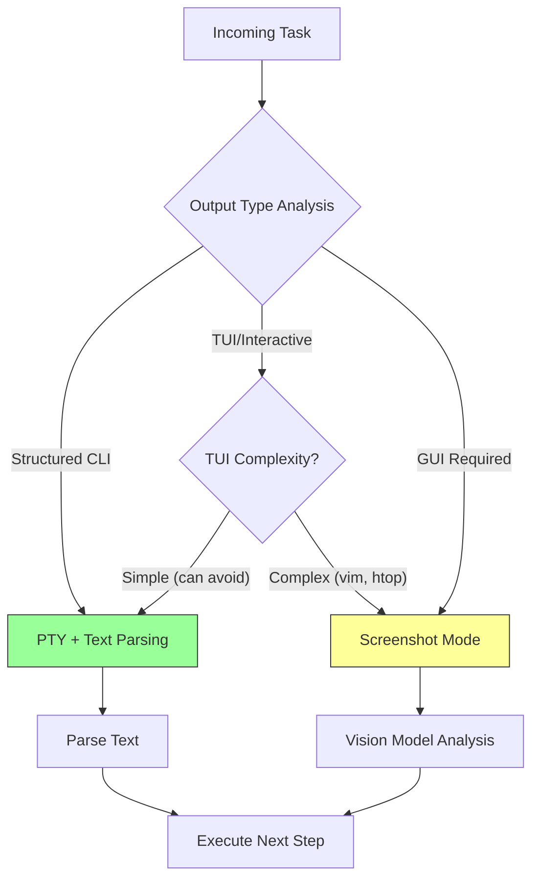

# Why PTY-Based Terminal Interaction

> **Status**: Architectural Decision Record  
> **Date**: 2026-01-20  
> **Decision**: Text-based PTY interaction as primary, with structured output
> preference and hybrid fallback path

---

## Executive Summary

TerminAI uses **PTY (pseudo-terminal) stdout/stderr parsing** rather than
screenshot-based vision for terminal interaction. This document explains why
this is the correct architectural choice for a System Operator agent, quantifies
the tradeoffs, and defines the hybrid strategy for edge cases.

```
┌─────────────────────────────────────────────────────────────────────────┐
│                         THE PTY THESIS                                   │
│                                                                          │
│   "For system operations, parse text precisely rather than                │
│    approximate it visually. Reserve vision for when you must."           │
│                                                                          │
│   We are building INFRASTRUCTURE AUTOMATION, not GUI robotics.          │
└─────────────────────────────────────────────────────────────────────────┘
```

---

## The Two Paradigms

### Paradigm A: PTY/Stdout (TerminAI's Approach)

```
Agent → sends command text → Shell (PTY) → reads stdout/stderr → parses → reasons
```

**Implementation**: `packages/core/src/computer/PersistentShell.ts`,
`packages/core/src/tools/shell.ts`

### Paradigm B: Screenshot (Industry Trend for GUI)

```
Agent → sends keyboard/mouse → Application → screenshot → vision model → reasons
```

**Industry examples**: Anthropic Claude Computer Use, OpenAI Operator, Google
Mariner

---

## Why PTY Wins for System Operations

### 1. Token Efficiency (10-20x Cheaper)

| Scenario                     | PTY Tokens | Screenshot Tokens | Difference      |
| ---------------------------- | ---------- | ----------------- | --------------- |
| `ls -la` (20 files)          | ~200       | ~3,000            | **15x cheaper** |
| `docker ps` (5 containers)   | ~150       | ~2,500            | **17x cheaper** |
| `git log -5`                 | ~300       | ~3,500            | **12x cheaper** |
| `cat config.json` (50 lines) | ~400       | ~3,000            | **7x cheaper**  |
| API response (JSON)          | ~500       | ~4,000            | **8x cheaper**  |

At scale, this compounds dramatically:

```
100 commands/session × 20 sessions/day × 2,500 token savings = 5M tokens/day saved
```

### 2. Latency (10-50x Faster)

| Operation       | PTY               | Screenshot + Vision            |
| --------------- | ----------------- | ------------------------------ |
| Execute command | ~10-50ms          | ~10-50ms                       |
| Read output     | ~1-5ms            | ~200-500ms (render)            |
| Process result  | ~1ms (text parse) | ~500-2000ms (vision inference) |
| **Total**       | **~15-60ms**      | **~700-2500ms**                |

For interactive system operations, this latency difference is
**user-perceptible**.

### 3. Precision (Exact vs Approximate)

```bash
# PTY Output (exact)
$ cat /etc/os-release | grep VERSION_ID
VERSION_ID="22.04"

# Vision reads "VERSION_ID="22.04"" and might OCR as:
# - VERSION_ID="22.04" ✓
# - VERSION_1D="22.04" ✗ (1 vs I confusion)
# - VERSION_ID="22.O4" ✗ (O vs 0 confusion)
```

For configuration values, API keys, version numbers, and UUIDs, **exact text is
non-negotiable**.

### 4. Structured Data Is Native

```bash
# PTY can request structured output
$ docker ps --format json
{"ID":"abc123","Image":"nginx","Status":"Up 2 hours",...}

# Agent parses JSON directly — no vision interpretation needed
```

The agent's preference for `--format json`, `--output yaml`, `-o jsonpath` flags
leverages this perfectly.

### 5. Headless Environments

System Operators primarily work on:

- SSH sessions to remote servers
- CI/CD pipelines (GitHub Actions, Jenkins)
- Containers without display
- Cloud VMs (EC2, GCE, Azure)

**None of these have screens to screenshot.** PTY is the only option.

---

## Where Screenshot Would Win

Honesty requires acknowledging where PTY struggles:

### TUI Applications

| Application          | PTY Challenge                   | Screenshot Advantage         |
| -------------------- | ------------------------------- | ---------------------------- |
| `vim`, `nano`        | Mode tracking, cursor position  | "I see the file on screen"   |
| `htop`, `btop`       | ANSI escape flood, live updates | Static visual snapshot       |
| `less`, `more`       | Paging state invisible          | Shows visible portion        |
| `tmux`, `screen`     | Pane state ambiguity            | Layout clearly visible       |
| `ncurses` installers | Option selection state          | Button/field positions clear |

### Color Semantics

```
[red] ERROR: Database connection failed  ← PTY strips color, loses "red = error" signal
[green] SUCCESS: All tests passed        ← Vision sees the semantic color
```

### Spatial Layout

```
┌─────────────────────────────────────────┐
│  File Browser    │    Preview Pane      │ ← Vision understands layout
│  > config.yaml   │    server:           │ ← PTY sees linear text stream
│    secrets.env   │      host: localhost │
└─────────────────────────────────────────┘
```

---

## TerminAI's Mitigation Strategy

Rather than building complex parsers (the sinkhole), TerminAI avoids TUI
complexity:

### 1. Structured Output Preference

```typescript
// packages/core/src/brain (heuristics)
// Agent prefers: docker ps --format json
// Over:          docker ps (table output)
```

The agent actively chooses flags that produce machine-readable output.

### 2. Non-Interactive Mode

```typescript
// Set in sandbox and shell execution
process.env['PAGER'] = 'cat'; // Disable paging
// Agent uses: git --no-pager log
// Agent uses: apt-get -y install
// Agent uses: rm -f (not prompting)
```

### 3. Script Fallback

When output is complex, generate a script to process it:

```python
# Instead of parsing htop visually, the agent runs:
import psutil
for proc in psutil.process_iter(['pid', 'name', 'cpu_percent']):
    print(f"{proc.info['pid']}: {proc.info['name']} - {proc.info['cpu_percent']}%")
```

This is enabled by the
[Sovereign Runtime Architecture](./architecture-sovereign-runtime.md)
guaranteeing Python + pip availability.

### 4. ANSI Stripping

```typescript
// packages/core/src/utils/ansi.ts
export function stripAnsi(text: string): string {
  return text.replace(/\x1B\[[0-9;]*[A-Za-z]/g, '');
}
```

Clean text for LLM consumption, even from colorized output.

---

## The Hybrid Future

The architecture is designed for **hybrid fallback**, not PTY-only forever:



### When to Trigger Screenshot Fallback (Future)

| Trigger                                          | Example                                | Action                      |
| ------------------------------------------------ | -------------------------------------- | --------------------------- |
| Command known to produce TUI                     | `htop`, `vim`, `nano`                  | Capture terminal screenshot |
| Output contains uninterpretable escape sequences | `\x1B[2J\x1B[H...`                     | Screenshot instead of parse |
| User explicitly requests visual                  | "Show me what the terminal looks like" | Screenshot                  |
| Error recovery                                   | "I can't understand this output"       | Screenshot for context      |

### Implementation Path

| Phase                 | Approach                                  | Status         |
| --------------------- | ----------------------------------------- | -------------- |
| **Phase 1 (Current)** | PTY + Structured Output + Script Fallback | ✅ Implemented |
| **Phase 2 (Future)**  | PTY + Screenshot for TUI detection        | 📋 Designed    |
| **Phase 3 (Future)**  | Full GUI Automation                       | 📋 Roadmap     |

Phase 2 implementation would require:

- Terminal emulator with canvas export (xterm.js has this)
- Vision model integration (already in provider system via Multi-LLM Support)
- Hybrid decision logic in `PersistentShell`

---

## Integration with Sovereign Runtime

The [Sovereign Runtime Architecture](./architecture-sovereign-runtime.md)
enables PTY strategy through:

### 1. Guaranteed Python Availability

When parsing gets complex, fall back to Python scripts:

```python
# T-APTS helpers for common parsing
from terminai_apts.parse import parse_ps_output, parse_netstat
```

### 2. RuntimeContext Interface

```typescript
interface RuntimeContext {
  pythonPath: string; // Guaranteed to exist
  isIsolated: boolean; // For risk assessment
  // ...
}
```

The agent can always generate and execute a parsing script, regardless of tier
(Container or Managed Local).

### 3. Tool Availability

The
[Survival Kit](./architecture-sovereign-runtime.md#23-core-capabilities-the-survival-kit)
guarantees:

- `jq` for JSON parsing in shell
- `python3` for complex parsing
- `curl` with `-s` for API calls returning JSON

---

## Token Cost Architecture

PTY-based parsing feeds into TerminAI's token efficiency mechanisms:

### 1. Tool Output Summarization

```json
// settings.json
{
  "model": {
    "summarizeToolOutput": {
      "run_shell_command": { "tokenBudget": 2000 }
    }
  }
}
```

Large outputs are truncated intelligently before LLM consumption.

### 2. Framework Selection

```typescript
// packages/core/src/brain/frameworkSelector.ts
// Simple tasks get FW_DIRECT (1 LLM call)
// Complex tasks get FW_REFLECT (3 calls but verified)
```

PTY's fast feedback enables quick framework decisions.

### 3. Loop Detection

```typescript
// packages/core/src/core/loopDetection.ts
// Detect when same command produces same error → try different approach
```

Text-based output enables reliable similarity detection.

---

## Comparison Table

| Dimension            | PTY/Stdout             | Screenshot                |
| -------------------- | ---------------------- | ------------------------- |
| **Token cost**       | Low (~200-500/command) | High (~3,000-5,000/image) |
| **Latency**          | ~15-60ms               | ~700-2500ms               |
| **Precision**        | Exact text             | OCR approximation         |
| **Structured data**  | Native parsing         | Visual interpretation     |
| **Headless servers** | ✅ Works               | ❌ No screen              |
| **TUI applications** | ⚠️ Fragile             | ✅ Natural                |
| **GUI applications** | ❌ Impossible          | ✅ Native                 |
| **Color semantics**  | ❌ Lost                | ✅ Preserved              |
| **Spatial layout**   | ❌ Linear stream       | ✅ 2D understanding       |

---

## Decision Summary

### Why PTY Is Correct for TerminAI

1. **Mission Alignment**: System Operator = servers, CLI, infrastructure =
   text-dominant
2. **Economics**: 10-20x token savings at scale
3. **Performance**: 10-50x faster feedback loops
4. **Reliability**: Exact text beats OCR approximation
5. **Environment**: Headless servers have no screens

### When to Pivot

If TerminAI's mission expands to:

- Desktop application automation
- Browser-based GUI testing
- Visual design verification

Then screenshot becomes essential. The architecture supports hybrid addition
without rewrite.

### What We Avoid

**The Sinkhole** = Building elaborate ANSI parsers, TUI state machines, vim mode
trackers

**Our Strategy** = Prefer structured output, avoid TUIs when possible, script
fallback for complexity, hybrid when necessary

---

## Appendix: Implementation References

| Component         | Location                                           | Purpose                                      |
| ----------------- | -------------------------------------------------- | -------------------------------------------- |
| PersistentShell   | `packages/core/src/computer/PersistentShell.ts`    | PTY management                               |
| Shell Tool        | `packages/core/src/tools/shell.ts`                 | Command execution                            |
| ANSI Utils        | `packages/core/src/utils/ansi.ts`                  | Escape code stripping                        |
| SystemSpec        | `packages/core/src/brain/systemSpec.ts`            | Available command detection                  |
| T-APTS Parsing    | `packages/sandbox-image/python/terminai_apts/`     | Python parsing helpers                       |
| Multi-LLM Support | `packages/core/src/core/openaiContentGenerator.ts` | Vision model integration (for future hybrid) |
