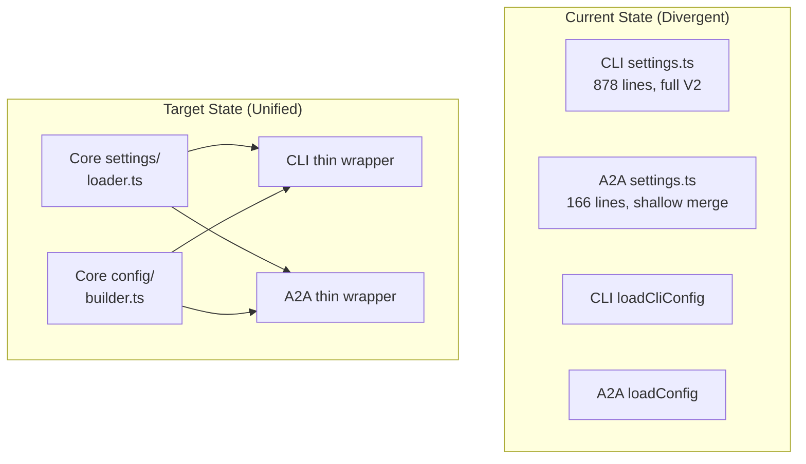

# CLI ↔ Desktop Parity: Architecture Specification

## 1. Executive Summary

**What**: Unify the settings loading and config construction pipelines between CLI and A2A server so Desktop behaves identically to CLI.

**Why**: Currently, CLI and A2A server load settings differently (4-scope vs 2-scope merge, V1→V2 migration, schema validation, trust-gated .env loading), causing "same input, different output" bugs in Desktop.

**When**: 3-5 days of focused implementation.

**Risk**: Breaking CLI behavior during refactor. Mitigated by Phase 1 (CLI calls shared loader, tests must pass unchanged before A2A adoption).

---

## 2. Architecture Overview

### System Diagram



### Component Responsibilities

| Component         | Location                                        | Responsibility                                          |
| ----------------- | ----------------------------------------------- | ------------------------------------------------------- |
| Settings Loader   | `packages/core/src/config/settings/loader.ts`   | Load, migrate, validate, merge settings from all scopes |
| Settings Schema   | `packages/core/src/config/settings/schema.ts`   | V2 schema definitions, merge strategies                 |
| Settings Migrate  | `packages/core/src/config/settings/migrate.ts`  | V1→V2 migration logic                                   |
| Settings Validate | `packages/core/src/config/settings/validate.ts` | Zod validation                                          |
| Settings Trust    | `packages/core/src/config/settings/trust.ts`    | Trust evaluation, .env loading                          |
| Config Builder    | `packages/core/src/config/builder.ts`           | Build runtime Config from LoadedSettings                |
| CLI Wrapper       | `packages/cli/src/config/config.ts`             | Thin wrapper calling shared modules                     |
| A2A Wrapper       | `packages/a2a-server/src/config/config.ts`      | Thin wrapper calling shared modules                     |

### Data Flow

```
1. Read settings files (systemDefaults → system → user → workspace)
2. Parse JSON-with-comments
3. Migrate V1→V2
4. Validate with Zod schema
5. Resolve env-var placeholders
6. Compute trust (system+user merged)
7. Load .env (trust-gated)
8. Final merge with all scopes
9. Build Config with identical interpretation
```

---

## 3. Technical Specification

### 3.1 Settings Loader Module

**Purpose**: Single source of truth for loading settings across all scopes with migration and validation.

**Interface**:

```typescript
// packages/core/src/config/settings/loader.ts

export interface SettingsLoaderOptions {
  mapLegacyThemeName?: (theme: string) => string;
  feedback?: (
    level: "error" | "warn" | "info",
    message: string,
    err?: unknown
  ) => void;
}

export interface LoadedSettings {
  system: SettingsFile;
  systemDefaults: SettingsFile;
  user: SettingsFile;
  workspace: SettingsFile;
  isTrusted: boolean;
  migratedInMemoryScopes: Set<SettingScope>;
  merged: Settings;

  forScope(scope: LoadableSettingScope): SettingsFile;
  setValue(scope: LoadableSettingScope, key: string, value: unknown): void;
}

export function loadSettingsV2(
  workspaceDir: string,
  options?: SettingsLoaderOptions
): LoadedSettings;
```

**Behavior**:

- Load from 4 scopes in order (systemDefaults, system, user, workspace)
- Apply V1→V2 migration per scope
- Validate each scope with Zod
- Merge using `customDeepMerge` with path-aware strategies
- Evaluate trust, load .env conditionally

**Files affected**:

- `packages/core/src/config/settings/loader.ts` (NEW)
- `packages/core/src/config/settings/schema.ts` (NEW - extracted from CLI)
- `packages/core/src/config/settings/migrate.ts` (NEW - extracted from CLI)
- `packages/core/src/config/settings/validate.ts` (NEW - extracted from CLI)
- `packages/core/src/config/settings/trust.ts` (NEW - extracted from CLI)
- `packages/core/src/config/settings/index.ts` (NEW - barrel export)

---

### 3.2 Config Builder Module

**Purpose**: Build runtime Config from LoadedSettings with identical interpretation as CLI.

**Interface**:

```typescript
// packages/core/src/config/builder.ts

export interface RuntimeInputs {
  sessionId: string;
  approvalModeOverride?: "default" | "auto_edit" | "yolo";
  includeDirectoriesOverride?: string[];
  workspacePathOverride?: string;
  outputFormat?: "text" | "json" | "stream-json";
  debug?: boolean;
  sandbox?: boolean;
  question?: string;
  voiceModeRequested?: boolean;
  extensionOverrides?: string[];
}

export async function buildConfigFromLoadedSettings(
  loaded: LoadedSettings,
  inputs: RuntimeInputs,
  extensionManager: ExtensionLoader
): Promise<Config>;
```

**Behavior**:

- Extract all parameters from merged settings
- Apply approval mode safety checks (disable yolo for voice/untrusted)
- Create policyEngineConfig
- Set contextFileName
- Build file+memory filtering options
- Initialize Config with all parameters

**Files affected**:

- `packages/core/src/config/builder.ts` (NEW)

---

### 3.3 CLI Integration

**Purpose**: CLI calls shared modules, no behavior change.

**Interface**: No new public interface; internal refactor only.

**Files affected**:

- `packages/cli/src/config/config.ts` - Replace inline logic with calls to core
- `packages/cli/src/config/settings.ts` - Re-export from core or thin wrapper

---

### 3.4 A2A Server Integration

**Purpose**: A2A server switches to shared loader/builder, achieving parity.

**Files affected**:

- `packages/a2a-server/src/config/settings.ts` - DELETE or replace with import
- `packages/a2a-server/src/config/config.ts` - Call `loadSettingsV2` + `buildConfigFromLoadedSettings`

---

## 4. Data Models

```typescript
// packages/core/src/config/settings/types.ts

export enum SettingScope {
  User = "User",
  Workspace = "Workspace",
  System = "System",
  SystemDefaults = "SystemDefaults",
  Session = "Session",
}

export type LoadableSettingScope =
  | SettingScope.User
  | SettingScope.Workspace
  | SettingScope.System
  | SettingScope.SystemDefaults;

export interface SettingsFile {
  path: string;
  settings: Settings;
  originalSettings: Settings;
  rawJson?: string;
}

export interface SettingsError {
  message: string;
  path: string;
}

// Settings interface remains as defined in CLI (V2 nested structure)
// with all subsections: tools, security, context, ui, mcp, extensions, etc.
```

---

## 5. Security Considerations

- **Trust gating**: .env files only loaded in trusted workspaces
- **Excluded env vars**: Respect `advanced.excludedEnvVars` setting
- **Schema validation**: Reject malformed settings before they affect behavior
- **Approval mode safety**: Yolo disabled for untrusted folders and voice mode

---

## 6. Testing Strategy

### Unit Tests

- Migration: V1 settings input → V2 output assertions
- Validation: Invalid settings → FatalConfigError
- Merge: Multi-scope merge with strategy assertions
- Trust: Various trust scenarios

### Integration Tests

- **Parity snapshot test**: Load config via CLI path and A2A path, compare Config projections
- Same settings files → same `merged` output
- Same `merged` → same `Config` parameters

### Manual Verification

```bash
# CLI test
cd /home/profharita && terminai "what is 2+2"

# Desktop test (after fixes)
# Same query, should produce identical response/behavior
```

---

## 7. Migration / Rollout Plan

### Phase 1: Extract to Core (CLI unchanged)

1. Create new modules in `packages/core/src/config/settings/`
2. CLI imports from core but logic is identical
3. **Gate**: All existing CLI tests pass

### Phase 2: A2A Adopts Shared Loader

1. Delete `packages/a2a-server/src/config/settings.ts`
2. A2A's `loadConfig` calls `loadSettingsV2` + `buildConfigFromLoadedSettings`
3. **Gate**: A2A tests updated and passing

### Phase 3: Parity Verification

1. Add snapshot parity tests
2. Manual E2E verification
3. **Gate**: No behavioral difference between CLI and Desktop

### Rollback

- Phase 1 is fully backward compatible
- Phase 2 can be reverted by restoring A2A's old settings.ts

---

## 8. Open Questions

1. **Theme mapping**: CLI maps legacy theme names (VS, VS2015). Should A2A do the same, or is it irrelevant for server?
2. **Extension consent**: CLI has rich consent UI. A2A uses SimpleExtensionLoader. Should we unify or keep separate?
3. **Format-preserving edits**: CLI preserves JSON formatting on save. A2A doesn't modify settings. Can we skip this for A2A?
